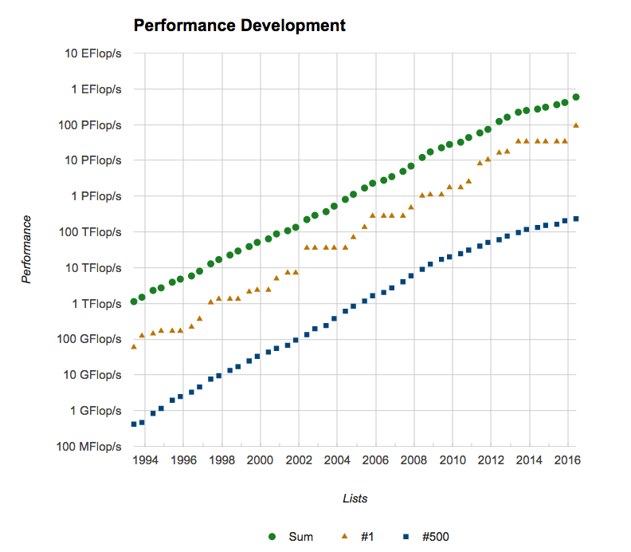
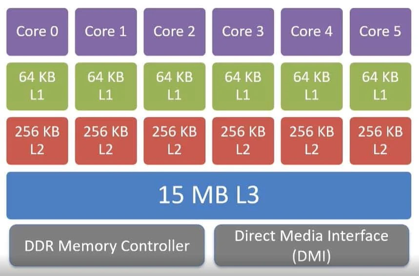
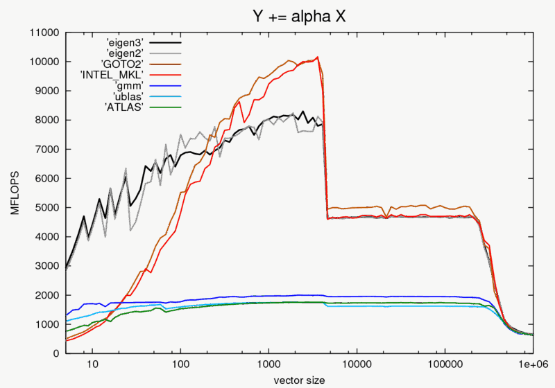

# Profiling

Profiling is the process of measuring where your code spends time and resources.
For scientific applications that may run for days or weeks on large
supercomputers, even small performance improvements in critical bottlenecks can
lead to massive time and energy savings.

In this lecture, we will:

- discuss when (and when not) to optimize a code

- understand how modern processors and memory work, and why it matters for
  performance

- learn simple rules to help the compiler generate fast code

- learn how to use a profiler to find the hot spots of a code

The original slides (by Jim Stone and Romain Teyssier) are available
[here](/_static/pdfs/profiling_stone_teyssier_slides.pdf).

## Performance

### The two principles of optimization

- First principle of optimization: **don't**
  - you sacrifice clarity
  - you sacrifice maintainability

- Second principle of optimization: **but you must**
  - the problems you can solve are determined by the performance of your code
  - access to shared resources (clusters) often requires demonstrating good
    performance

### Measuring performance

- The quantum of time on a computer is a clock period (or cycle), which is the
  inverse of the frequency at which the processor runs.

- The processor frequency is variable on most CPUs (e.g. turbo-boost), which
  complicates performance measurements.

- Generally, performance $\propto$ 1/time. The goal is to minimize the time
  spent in each step of the computation (calculations, I/O, communication,
  etc.).

- Performance can be measured using
  - profiling tools like `gprof` and VTune
  - a benchmark: a real-world application or kernel run on the hardware being
    tested. For example, the Linpack benchmark is used for the
    [Top500](https://top500.org) list.

### We're spoiled by Moore's Law

In 1965, Gordon Moore predicted that the transistor density in integrated
circuits would double every two years. In practice, performance has doubled
roughly every 18 months, as shown by the Top500 list of the fastest computers in
the world:



But we are forced to use mass-produced commodity processors that were not
designed for scientific computing. To use them efficiently, we need to
understand how they work.

## Processor design

### CPU, sockets, cores and threads

- The CPU reads in, decodes, and executes machine instructions, working on
  memory and peripherals. On Linux, use `lscpu` or `cat /proc/cpuinfo` to get
  the CPU architecture details.

- A **core** is an independent processing unit on a single chip.

- A **socket** is the interface between the CPU and the motherboard. A node with
  2 sockets and 16 cores per socket has 32 physical cores. Work on the node is
  called MIMD (Multiple Instructions Multiple Data).

- A **thread** is the basic ordered sequence of instructions processed by a
  single core. A core with two hardware threads can execute instructions from
  two software threads without the overhead of switching between them.

- The number of logical cores is "Thread(s) per core" × "Core(s) per socket" ×
  "Socket(s)". You can check it with `nproc --all`.

### Register-to-register architecture

Virtually all processors use a register-to-register architecture: data
processed by the CPU enters and leaves via registers. The statement `C = A + B`
becomes

```text
Load  R1, A
Load  R2, B
Add   R3, R1, R2
Store R3, C
```

Each operation requires at least one clock period, so this example takes at
least four clock periods.

### Pipelining

The same sequence of instructions is often repeated many times (e.g. inside
loops). Processors are designed so that different steps of the sequence can
execute at the same time, like an assembly line:

| Clock cycle | 1   | 2   | 3   | 4   | 5   | 6   | 7   | 8   | 9   |
| :---------- | :-- | :-- | :-- | :-- | :-- | :-- | :-- | :-- | :-- |
| instr. i    | IF  | ID  | ME  | EX  | WB  |     |     |     |     |
| instr. i+1  |     | IF  | ID  | ME  | EX  | WB  |     |     |     |
| instr. i+2  |     |     | IF  | ID  | ME  | EX  | WB  |     |     |
| instr. i+3  |     |     |     | IF  | ID  | ME  | EX  | WB  |     |
| instr. i+4  |     |     |     |     | IF  | ID  | ME  | EX  | WB  |

IF = instruction fetch, ID = instruction decode, ME = memory reference, EX =
execute, WB = write back.

- The pipeline takes 9 clock cycles to complete 5 instructions, instead of 5 × 5
  = 25 cycles for an un-pipelined processor.

- Once the pipeline is full, a result is produced every clock cycle.

- This is an example of instruction level parallelism (ILP).

### Vectorization (SIMD)

- Vectorization is an example of **data parallelism**: identical instructions
  are performed on multiple data simultaneously (SIMD = Single Instruction
  Multiple Data).

- Successive generations of Intel instruction sets (SSE, AVX2, AVX-512) have
  doubled the width of the vector registers. With AVX-512, a register holds 512
  bits, i.e. 16 single precision or 8 double precision numbers, all processed
  in one instruction.

- A surprisingly common complaint: _"My code runs fast on large problems, but is
  3-4x slower on small problems."_ Most likely, vectorization is inefficient
  because the loop limits are smaller than the vector length.

## Memory design

### Reading data from RAM is slow

- Most memory today is Dynamic Random Access Memory (DRAM), with a typical
  access time of 100 ns, i.e. hundreds of clock cycles.

- Memory capacity and bandwidth grow more slowly than processor performance,
  leading to a growing memory/processor performance mismatch.

- Good performance requires maximizing the number of floating point operations
  per memory access.

### Hierarchical memory: the cache

To hide this latency, processors use small and fast memories close to the cores,
called **caches**:

- **L1 cache**: the smallest (tens of KB) and fastest, accessed in a single
  clock cycle.

- **L2 cache**: larger (up to several MB), accessed in a few clock cycles.

- **L3 cache**: even larger, slower than L1 and L2, but still faster than the
  main memory. Each core has its own L1 and L2, but all cores share the L3.



Example of cache memory architecture for a 6-core socket.

### Cache lines, hits and misses

- Most programs access adjacent memory locations sequentially (principle of
  locality).

- Data is transferred between levels in blocks called **cache lines**. When item
  at address `A` is loaded, the entire cache line containing `A`, `A+1`, `A+2`,
  etc. is moved. If the processor needs `A+1` on the next cycle, it is already
  in cache.

- A **cache hit** (miss) occurs if the data is (is not) in cache when needed. A
  cache miss triggers a slow load from main memory.

- The effective access time is

  $$t_{\rm eff} = H t_{\rm cache} + (1-H) t_{\rm main}$$

  where $H$ is the hit rate. With $t_{\rm cache}=10$ ns, $t_{\rm main}=100$ ns
  and $H=98\%$, we get $t_{\rm eff}=11.8$ ns: almost as fast as cache!

- **Goal of the programmer: write code that maximizes the hit rate.**

Another common complaint: _"My code runs fine on a small problem, but when I
try a bigger problem, it slows to a crawl."_ Most likely, the data structures no
longer fit in cache (much slower) or in main memory (much, much slower). The
following benchmark of `y += alpha * x` shows the drop in performance when the
vectors no longer fit in cache:



Source: [Eigen benchmark](http://eigen.tuxfamily.org/index.php?title=Benchmark).

### Write code to maximize cache hits

Always access data contiguously: order the loops so that the inner loop runs
over neighboring elements in memory (stride of one).

In C and C++, arrays are stored in **row-major** order (`m[0][0]`, `m[0][1]`,
`m[0][2]`, ...), so the last index should vary fastest:

```c
// row.c
#include <stdio.h>
#include <time.h>
int m[9999][9999];

int main() {
  clock_t start, stop;

  start = clock();
  for (int i = 0; i < 9999; i++)
    for (int j = 0; j < 9999; j++)
      m[i][j] = m[i][j] + (m[i][j] * m[i][j]);
  stop = clock();
  printf("The run-time of row major order is %lf\n",
         (double)(stop - start) / CLOCKS_PER_SEC);

  start = clock();
  for (int j = 0; j < 9999; j++)
    for (int i = 0; i < 9999; i++)
      m[i][j] = m[i][j] + (m[i][j] * m[i][j]);
  stop = clock();
  printf("The run-time of column major order is %lf\n",
         (double)(stop - start) / CLOCKS_PER_SEC);
  return 0;
}
```

```sh
$ gcc -Og -o row row.c
$ ./row
  The run-time of row major order is 0.257015
  The run-time of column major order is 0.690201
```

Fortran uses exactly the **opposite** convention: arrays are stored in
**column-major** order (`m(1,1)`, `m(2,1)`, `m(3,1)`, ...), so the first index
should vary fastest:

```fortran
! column.f90
program column
  integer :: i, j
  real :: tstart, tstop
  integer, dimension(1:9999, 1:9999) :: m

  call cpu_time(tstart)
  do i = 1, 9999
     do j = 1, 9999
        m(i,j) = m(i,j) + m(i,j)*m(i,j)
     end do
  end do
  call cpu_time(tstop)
  write(*,*) 'The run-time of row major order is', tstop - tstart

  call cpu_time(tstart)
  do j = 1, 9999
     do i = 1, 9999
        m(i,j) = m(i,j) + m(i,j)*m(i,j)
     end do
  end do
  call cpu_time(tstop)
  write(*,*) 'The run-time of column major order is', tstop - tstart
end program column
```

```sh
$ gfortran -Og column.f90 -o col
$ ./col
  The run-time of row major order is  0.916261017
  The run-time of column major order is  0.148454964
```

The same applies in Python: NumPy arrays are row-major by default (like C).

Also:

- Use pointers carefully and sparingly: if a variable can be referenced in
  multiple ways (aliasing), the compiler cannot keep it in a register.

- Avoid indirect addressing like `a[i[j]]`.

## Role of compilers

Hardware is designed to optimize the instructions produced by compilers.
Compilers can:

- inline procedures into the calling code
- eliminate common sub-expressions and unnecessary temporary variables
- change the order of instructions (e.g. move code outside a loop)
- pipeline and vectorize loops automatically
- optimize register allocation

In short, compilers can do a lot, so **let the compiler do the work**.

### Compiler options

For the GNU compilers (`man gcc` or `man gfortran`):

| Option     | Description                                                |
| :--------- | :--------------------------------------------------------- |
| `-O0`      | no optimization, useful for debugging                      |
| `-O1`      | conservative optimization, does not increase code size     |
| `-O2`      | normal optimization, vectorization and loop optimization   |
| `-O3`      | aggressive optimization, takes longer to compile and risky |
| `-fopenmp` | activate OpenMP parallelization                            |
| `-g`       | add extra information for debuggers                        |

```sh
gfortran -O3 -fopenmp -x f95-cpp-input -DNDIM=2 code.f90 -o code
```

### Examples of compiler optimizations

- **Inlining**: replace a function call by its content in the calling routine.

- **Loop unrolling**: reduce the loop overhead and expose more parallelism.

```fortran
! before
do i = 1, n
   a(i) = b(i) + d*c(i)
end do

! after
do i = 1, n-3, 4
   a(i)   = b(i)   + d*c(i)
   a(i+1) = b(i+1) + d*c(i+1)
   a(i+2) = b(i+2) + d*c(i+2)
   a(i+3) = b(i+3) + d*c(i+3)
end do
do j = i, n
   a(j) = b(j) + d*c(j)
end do
```

- **Divisions**: replace slow divisions by multiplications.

```fortran
! before
do i = 1, n
   do j = 1, m
      a(i,j) = d(j)/2
   end do
end do

! after
tempdiv = 1/2.
do i = 1, n
   do j = 1, m
      a(i,j) = d(j)*tempdiv
   end do
end do
```

- **Loop tiling**: work on blocks of size `B` that fit in cache.

```c
// before
for (i = 0; i < n; i++)
  for (j = 0; j < n; j++)
    a[i][j] += b[i][j];

// after
for (ii = 0; ii < n; ii += B)
  for (jj = 0; jj < n; jj += B)
    for (i = ii; i < ii + B; i++)
      for (j = jj; j < jj + B; j++)
        a[i][j] += b[i][j];
```

- **Local versus global variables**: local variables allow better cache
  management.

## Algorithms and data structures

Most of the speed-up in scientific computing comes from **algorithms**, not from
faster computers: iterative versus direct solvers, multigrid, conjugate gradient,
FFT, tree codes, fast multipole methods...

The importance of scaling is illustrated by this example from _Programming
Pearls_ (Column 8), with 4 different algorithms for the same problem:

| Problem size n | $1.3n^3$     | $10n^2$  | $47 n \log_2 n$ | $48n$     |
| :------------- | :----------- | :------- | :-------------- | :-------- |
| $10^3$         | 1.3 secs     | 10 msecs | 0.4 msecs       | 0.05 msec |
| $10^4$         | 22 mins      | 1 sec    | 6 msecs         | 0.5 msecs |
| $10^5$         | 15 days      | 1.7 min  | 78 msecs        | 5 msecs   |
| $10^6$         | 41 yrs       | 2.8 hrs  | 0.94 secs       | 48 msecs  |
| $10^7$         | 41 millennia | 1.7 wks  | 11 secs         | 0.48 secs |

- Use back-of-the-envelope calculations to estimate the time and memory required
  for your task. Do you need a better algorithm or data structure?

- Choose the best data structure (arrays, linked lists, hash tables, trees,
  heaps) at the start: it is very hard to change later.

## Profiling

### What is a profile?

A profile measures where a program spends its time:

- frequency counts of routines
- total time spent in each routine (and its children)

The term _profile_ was invented by Donald Knuth in 1971.

### When to worry about performance?

> "Programmers waste enormous amounts of time thinking about, or worrying about,
> the speed of noncritical parts of their programs, and these attempts at
> efficiency have a strong negative impact when debugging and maintenance are
> considered. We should forget about small efficiencies, say about 97% of the
> time: premature optimization is the root of all evil. Yet we should not pass
> up our opportunities in that critical 3%. [...] It is often a mistake to make
> a priori judgments about what parts of a program are really critical, since
> the universal experience of programmers who have been using measurement tools
> has been that their intuitive guesses fail."
>
> — Donald Knuth, 1974

### Concentrate on the hot spots

- Say your program takes 100 seconds and spends 90% of its time in one routine.

- If you cut the run time of that routine by a factor of 3, the code now takes
  40 seconds (60% less time).

- If instead you cut the run time of the whole rest of the program by a factor
  of 3, the code now takes 97 seconds (3% less time).

### Profiling with `gprof`

- The traditional Unix tools are `prof` and `gprof`. They require compiling and
  linking with a special option (`-pg`).

- They use **PC sampling**: every so often, the system interrupts your program
  and records which instruction it is executing (the Program Counter).

- Modern processors also contain hardware counters recording what the processor
  is doing (cache misses, vector instructions, etc.), accessible with more
  advanced tools.

```sh
$ g++ -pg imageAccess.cpp -o imageAccess
$ ./imageAccess 400
$ gprof imageAccess
```

For a 400×400 image (1000 calls of each routine):

```text
  %   cumulative   self              self     total
 time   seconds   seconds    calls  us/call  us/call  name
 34.47      0.22     0.22     1000   220.63   220.63  add1(Image&, int)
 26.64      0.39     0.17     1000   170.49   170.49  add2(Image&, int)
 17.24      0.50     0.11     1000   110.32   110.32  add3(Image&, int)
 12.54      0.58     0.08     1000    80.23    80.23  set(Image&, int)
  9.40      0.64     0.06     1000    60.17    60.17  Image::Image(int, int)
```

For a 4000×4000 image (only 10 calls of each routine):

```text
  %   cumulative   self              self     total
 time   seconds   seconds    calls  ms/call  ms/call  name
 52.31      1.21     1.21       10   121.35   121.35  add1(Image&, int)
 17.72      1.62     0.41       10    41.12    41.12  Image::Image(int, int)
 10.37      1.87     0.24       10    24.07    24.07  add2(Image&, int)
  9.94      2.10     0.23       10    23.07    23.07  set(Image&, int)
  9.94      2.33     0.23       10    23.07    23.07  add3(Image&, int)
```

`add1` is only a little slower than `add2` on the small image, but becomes 5
times slower on the large one. Why? (Hint: think about the cache!)

### Advanced profilers

- **Linaro MAP** (formerly Allinea MAP, part of Linaro Forge): C, C++, Fortran,
  lightweight GUI, source code profiling of compute, I/O, memory and MPI
  bottlenecks.

- **Intel VTune**: extraordinarily powerful (and complicated), nice GUI, shared
  memory only (serial, OpenMP, MPI on a single node).

- **Intel Trace Analyzer and Collector**: creates a timeline for every process,
  good for MPI scaling and bottlenecks, but can have a large overhead and create
  big files.

See the
[Princeton Research Computing knowledge base](https://researchcomputing.princeton.edu/support/knowledge-base/map)
to get started.

## Lessons learned

- Don't optimize prematurely, and don't sacrifice clarity for the sake of
  efficiency, especially early on.

- Choose efficient algorithms and data structures from the beginning: these can
  make a big difference.

- Whenever possible, iterate over arrays in their natural order.

- Let the compiler do the work.

- If efficiency is important, profile the code once it's working to find the
  hot spots (the critical 3%).
