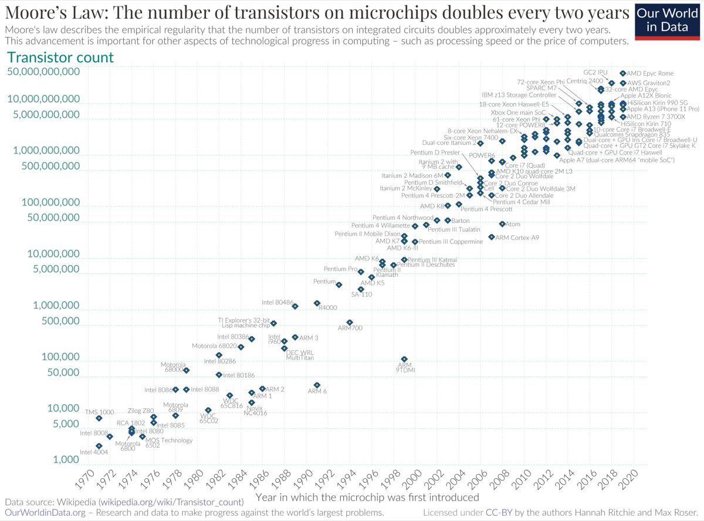
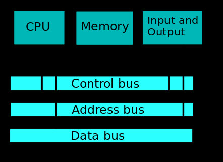
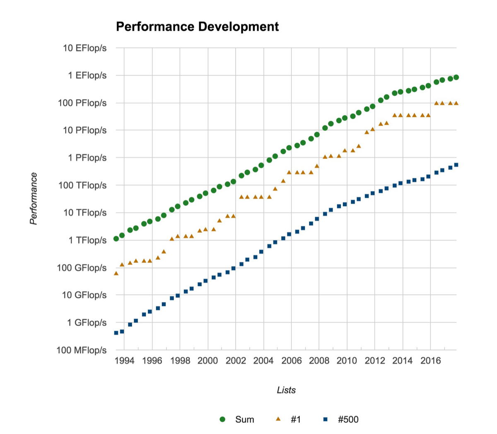
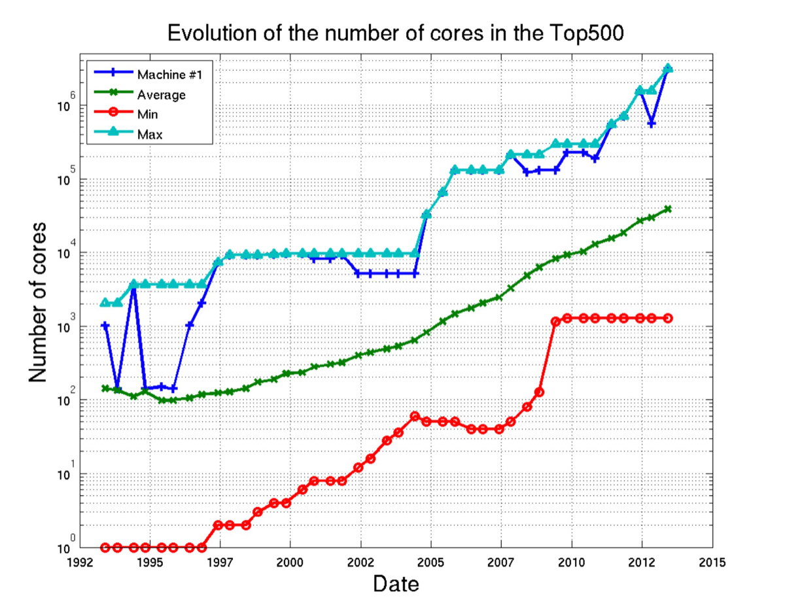
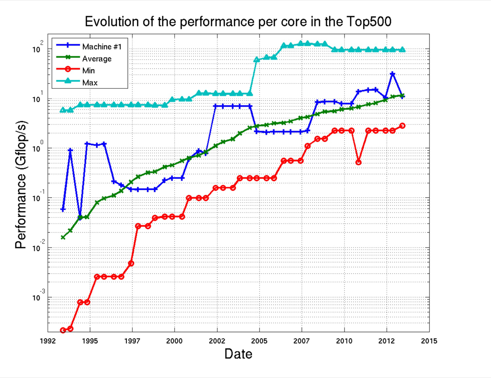
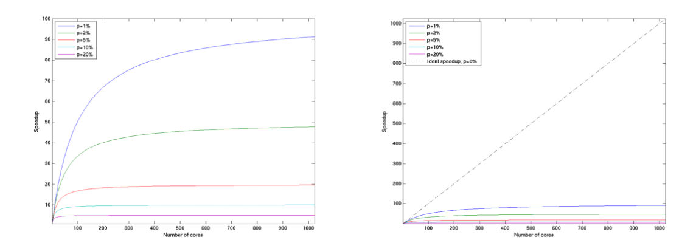
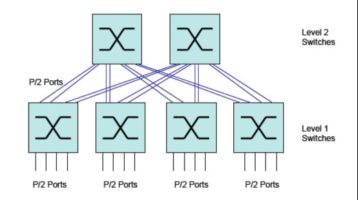
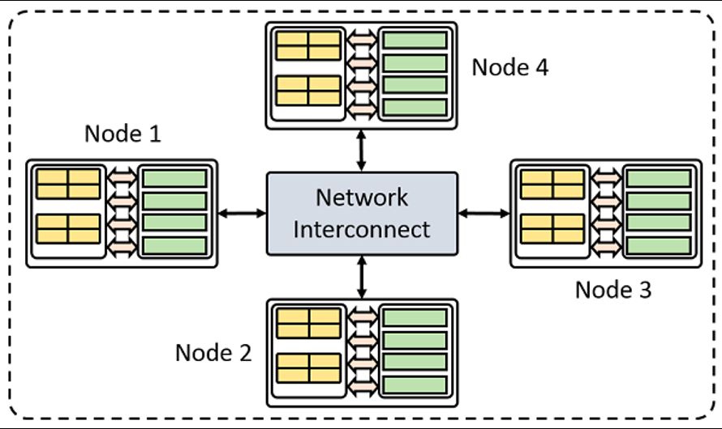

# Introduction to parallel computing

For decades, scientific codes got faster for free: each new generation of
processors ran at a higher clock frequency. That free lunch is over. Today,
performance gains come almost exclusively from parallelism, and scientific
software has to be written to exploit many cores, many nodes, and accelerators.

In this lecture, we will:

- review Moore's law and why processor frequency has stopped increasing

- understand the memory wall and the evolution of supercomputer hardware

- learn the two fundamental laws of parallel processing: Amdahl's law and
  Gustafson's law

- get an overview of the communication networks and programming languages used
  for parallel computing
  - Open Multi-Processing (OpenMP)
  - Message Passing Interface (MPI)
  - Graphics Processing Units (GPU)

The original slides are available
[here](/_static/pdfs/Parallel_Programming_Intro.pdf).

## Moore's law

### Statement of the law

Gordon Moore, a founder of Intel, stated in 1965 that:

> The number of transistors that can be placed on an integrated circuit at a
> reasonable cost doubles every two years.

_Data source: Wikipedia; figure from
[OurWorldInData.org](https://ourworldindata.org), licensed under CC-BY by Hannah
Ritchie and Max Roser._

### Hardware evolution

- Processor frequency has reached a plateau around 3 GHz since 2002-2004, but
  Moore's law is still true.

- Instead, we get more cores per chip (many-core architectures, GPUs...).

### Energy consumption and cost

- The dissipated electric power scales as the clock frequency to the cube.

- The dissipated power per square cm is limited by cooling.

Increasing the frequency is therefore no longer an option: the extra
transistors are used to add more cores instead.

## The memory wall

### Von Neumann architecture

Programming instructions (stored-program) and data share the memory unit. They
are loaded into the Central Processing Unit (CPU) for execution. Results are
written back to the memory unit.

### The Von Neumann bottleneck

- Memory bandwidth is not increasing as quickly as processor computing power.

- Memory latency is decreasing very slowly.

- The number of computing cores per memory unit is increasing.

### Consequences and solutions

- The CPU wastes cycles while waiting for data.

- Introduction of cache memory (L1, L2, L3).

- Parallel access to memory (vector architectures, AVX).

## Supercomputer trends in the Top500

The [Top500](https://top500.org) list ranks the fastest computers in the world
twice a year. It gives a nice view of how supercomputers have evolved.

### Performance

### Number of cores

### Performance per core

The total performance keeps growing exponentially, but this growth is now driven
by the number of cores, while the performance of each individual core has
plateaued.

## Parallel processing

### Amdahl's law

Gene Amdahl (1967) derived the theoretical maximum speedup obtained by ideally
parallelizing a code, for a given problem with a **fixed size**:

$$
\text{Speedup}(N) = \frac{T_s}{T_p(N)} = \frac{1}{\alpha + \frac{1-\alpha}{N}}
$$

where

- $T_s$ is the execution time of the serial code
- $T_p$ is the execution time of the parallel code
- $\alpha$ is the fraction of the code that is not parallel
- $N$ is the number of processors

In the limit of an infinite number of processors, the speedup saturates:

$$
\text{Speedup}(N) \rightarrow \frac{1}{\alpha} \quad \text{for} \quad N
\rightarrow +\infty
$$

### Strong scaling

Amdahl's law describes **strong scaling**: the problem size is fixed, and we add
more cores to solve it faster. The theoretical maximum speedup is:

| Cores    | $\alpha$ = 0 | 0.01% | 0.1% | 1%   | 2%   | 5%    | 10%  | 25%  | 50%   |
| :------- | :----------- | :---- | :--- | :--- | :--- | :---- | :--- | :--- | :---- |
| 10       | 10           | 9.99  | 9.91 | 9.17 | 8.47 | 6.90  | 5.26 | 3.08 | 1.82  |
| 100      | 100          | 99.0  | 91.0 | 50.2 | 33.6 | 16.8  | 9.17 | 3.88 | 1.98  |
| 1000     | 1000         | 909   | 500  | 91   | 47.7 | 19.6  | 9.91 | 3.99 | 1.998 |
| 10000    | 10000        | 5000  | 909  | 99.0 | 49.8 | 19.96 | 9.99 | 3.99 | 2     |
| 100000   | 100000       | 9091  | 990  | 99.9 | 49.9 | 19.99 | 10   | 4    | 2     |
| $\infty$ | $\infty$     | 10000 | 1000 | 100  | 50   | 20    | 10   | 4    | 2     |

Even with only 1% of non-parallel code, you can never go faster than 100 times
the serial code, no matter how many cores you use. The right panel compares
these curves to the ideal speedup ($\alpha = 0$).

### Gustafson's law

John Gustafson and Edwin Barsis (1988) derived the theoretical maximum speedup
obtained by ideally parallelizing a code for a problem of **constant size per
core**:

$$
\text{Speedup}(N) = \frac{T_s(N)}{T_p(N)} = \alpha + (1-\alpha)N
$$

Assuming that the execution time of the non-parallel part of the code remains
constant, one has:

$$
T_s(N) = \alpha T_0 + N(1-\alpha)T_0
$$

$$
T_p(N) = \alpha T_0 + (1-\alpha)T_0 = T_0
$$

### Weak scaling

Gustafson's law describes **weak scaling**: the problem size grows with the
number of cores. This law is more optimistic than Amdahl's law:

$$
\text{Speedup}(N) \rightarrow (1-\alpha)N \quad \text{for} \quad N
\rightarrow +\infty
$$

In both laws, everything is determined by $\alpha$, the non-parallel fraction of
the code. Reducing $\alpha$ is called "parallel code optimization".

## Hardware evolution

### Technical trends

- Computing power is doubling every year.

- Massively parallel and many-core architectures are dominant.

- Since 2010, Graphics Processing Units have become a key player.

- Hardware complexity is increasing (hybrid systems, multiple cache layers).

- Memory per core is plateauing or decreasing.

- Performance per core is plateauing.

- Disk Input/Output bandwidth is increasing very slowly.

_A Cray XC50 blade with GPUs._

### Consequences

- It is necessary to exploit many (relatively slow) cores.

- The memory per core is constant or even decreasing (memory limited).

- The raw performance of individual cores is not increasing anymore.

- Higher level of parallelism and I/O bottlenecks.

- More complex architectures (cache levels, accelerators, latency...).

- Multi-disciplinary approach, concept of "co-design".

## Communication network

Connecting millions of processors requires a high-performance network.

- Most existing systems use "InfiniBand" or variations.

- A network switch is needed to interconnect all the nodes.

- High-quality fiber cables are needed to connect each node to the switch.

The fat-tree network is a non-blocking network topology invented by Charles Clos
(1953). Depending on how many switches you can afford, you might choose blocking
configurations instead.

See for example <https://www.nvidia.com/en-us/networking/infiniband-configurator> and
<http://clusterdesign.org/fat-trees/>.

The key network parameters (switches and cables) are the **latency** and the
**bandwidth**. For an InfiniBand network, the latency is 0.5-1 microsecond, and
the bandwidth is 5-10 GB/s.

## Parallel programming languages

Evolution of programming methods:

- MPI is still the dominant programming technique.

- The hybrid OpenMP/MPI approach is the most effective on supercomputers.

- GPU programming is developing quickly:
  - CUDA
  - OpenACC and OpenMP
  - Message passing directly within the GPU

- New specific parallel programming languages are being developed:
  - Co-array Fortran, PGAS, X10, Chapel...

- New runtime systems handle task-based parallelism:
  - Charm++, HPX, Kokkos

### Distributed memory versus shared memory

- MPI uses a **distributed memory** paradigm: data are transferred explicitly
  between nodes through the network.

- OpenMP uses a **shared memory** paradigm: data are shared implicitly within
  the node through the Random-Access Memory.

