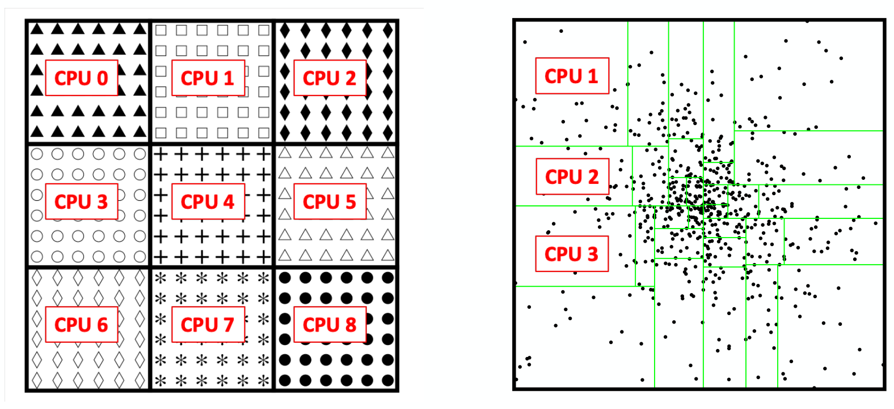
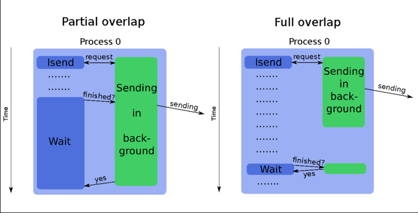
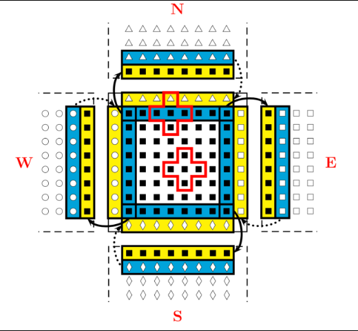
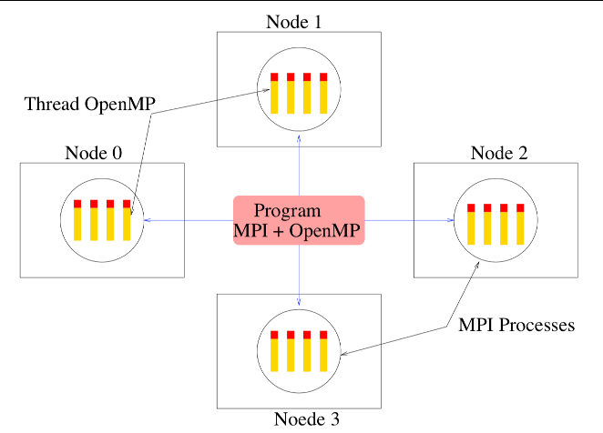
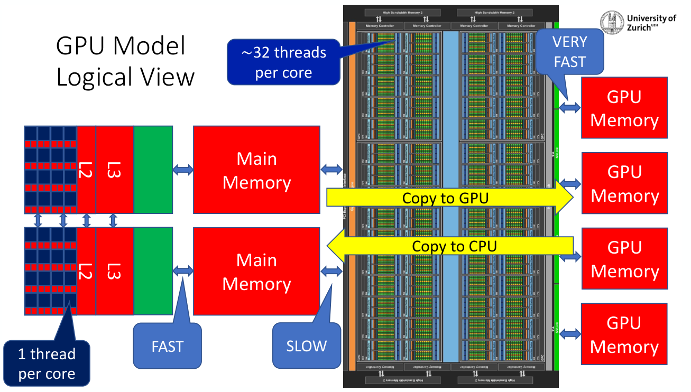

# Programming with MPI

OpenMP lets you use all the cores of a single node, but the largest scientific
simulations run on thousands of nodes. To go beyond one node, processes have to
communicate explicitly by sending messages to each other over the network. The
Message Passing Interface (MPI) is the standard library for doing this.

In this lecture, we will:

- review the history of MPI, its implementations, and the tools around it

- understand the general concepts of message passing and domain decomposition

- learn how to write a basic MPI program

- use blocking and non-blocking point-to-point communications

- use collective communications

- compare MPI and OpenMP, and briefly introduce GPU programming

## Parallel programming languages

Evolution of programming methods:

- MPI is still the dominant programming technique.

- The hybrid OpenMP/MPI approach is the most effective on supercomputers.

- GPU programming is developing quickly:
  - CUDA
  - OpenACC and OpenMP
  - Message passing directly within the GPU

- New specific parallel programming languages are being developed:
  - Co-array Fortran, PGAS, X10, Chapel...

- New runtime systems handle task-based parallelism:
  - Charm++, HPX, Kokkos

### Distributed memory versus shared memory

- MPI uses a **distributed memory** paradigm: data are transferred explicitly
  between nodes through the network.

- OpenMP uses a **shared memory** paradigm: data are shared implicitly within
  the node through the Random-Access Memory.


## MPI history

- **MPI 1**
  - Version 1.0 (June 1994): 40 different organizations develop the MPI
    standard, with various subroutines defining the first MPI library
  - Version 1.1 (June 1995)
  - Version 1.2 (1997)
  - Version 1.3 (September 2008): final version

- **MPI 2**
  - Version 2.0 (July 1997): includes new features intentionally left out of MPI
    1, such as dynamic process management, one-sided communication, and parallel
    I/O
  - Version 2.1 (June 2008)
  - Version 2.2 (September 2009)

- **MPI 3**
  - Version 3.0 (September 2012): includes new features left out of MPI 2, such
    as non-blocking collective communications, Fortran 2008 bindings, and
    interfacing with external tools
  - Version 3.1 (June 2015)

- **MPI 4**
  - Version 4.0 (June 2021): persistent collectives, partitioned communication,
    sessions, and large-count routines for million-way parallelism
  - Version 4.1 (November 2023)

- **MPI 5**
  - Version 5.0 (June 2025): a standard Application Binary Interface (ABI)

## MPI implementations

Open source libraries can be installed on almost any architecture (for example
on your laptop):

- [MPICH](https://www.mpich.org)
- [Open MPI](https://www.open-mpi.org)

Vendors also provide their own implementations, for example:

- Intel MPI
- IBM Spectrum MPI
- HPE Cray MPICH

## MPI tools

Debuggers and performance analysis tools:

- [TotalView](https://totalview.io)
- [Linaro DDT](https://www.linaroforge.com) (formerly Arm DDT)
- [Scalasca](https://www.scalasca.org)

Scientific libraries:

- [ScaLAPACK](https://www.netlib.org/scalapack/)
- [PETSc](https://petsc.org)
- [FFTW](https://www.fftw.org)

## General concepts

### Parallel processing

MPI is a library which allows process coordination and scheduling between
millions of processors using a message-passing paradigm.

### Message attributes

- The message is sent from a source process to a target process: it has a sender
  address and a recipient address.

- The message contains a header with
  - the identifier of the sending process (sender id)
  - the type of the message data (datatype)
  - the length of the message data (data length)
  - the identifier of the receiving process (receiver id)

- The message contains data.

### The MPI environment

- The messages are managed and interpreted by a runtime system, comparable to a
  telephone provider, an email system or a postal company.

- Messages are sent to a specific address. Receiving processes must be able to
  classify and interpret incoming messages.

- An MPI application is a group of autonomous processes deployed on different
  nodes, each one executing its own code and communicating with the other
  processes via calls to routines in the MPI library.

### Data distribution

Data (grid cells or particles) are distributed between nodes and cores using a
**domain decomposition** strategy. On the left, a regular grid is split into 9
equal domains. On the right, the domains of a particle simulation adapt to the
particle density, so that each process gets roughly the same amount of work.



## MPI basics

### Setting up the MPI environment

The MPI definitions are made available with:

- `include 'mpif.h'` in Fortran (MPI 1) or `#include <mpi.h>` in C/C++
- `use mpi` in Fortran (MPI 2), or `use mpi_f08` for the modern Fortran 2008
  bindings

The MPI environment is launched with the `MPI_INIT()` routine and terminated
with the `MPI_FINALIZE()` routine.

C syntax:

```c
int MPI_Init(int *argc, char ***argv);
int MPI_Finalize(void);
```

Fortran syntax:

```fortran
call MPI_INIT(code)
call MPI_FINALIZE(code)
```

### Who am I?

Each process can query the total number of processes in the communicator
`MPI_COMM_WORLD` with `MPI_COMM_SIZE()`, and its own identifier (its **rank**)
with `MPI_COMM_RANK()`:

```fortran
program who_am_I
  use mpi
  implicit none
  integer :: nb_procs,rank,code

  call MPI_INIT(code)

  call MPI_COMM_SIZE(MPI_COMM_WORLD,nb_procs,code)
  call MPI_COMM_RANK(MPI_COMM_WORLD,rank,code)

  print *,'I am the process ',rank,' among ',nb_procs

  call MPI_FINALIZE(code)
end program who_am_I
```

```sh
$ mpif90 who_am_I.f90 -o who_am_I
$ mpiexec -n 7 who_am_I
 I am the process            3  among            7
 I am the process            0  among            7
 I am the process            4  among            7
 I am the process            1  among            7
 I am the process            5  among            7
 I am the process            2  among            7
 I am the process            6  among            7
```

The processes print in a random order: they all run independently.

## Point-to-point communications

### Blocking send and receive

```fortran
program point_to_point
  use mpi
  implicit none

  integer, dimension(MPI_STATUS_SIZE) :: status
  integer, parameter                  :: tag=100
  integer                             :: rank,value,code

  call MPI_INIT(code)

  call MPI_COMM_RANK(MPI_COMM_WORLD,rank,code)

  if (rank == 2) then
     value=1000
     call MPI_SEND(value,1,MPI_INTEGER,5,tag,MPI_COMM_WORLD,code)
  elseif (rank == 5) then
     call MPI_RECV(value,1,MPI_INTEGER,2,tag,MPI_COMM_WORLD,status,code)
     print *,'I, process 5, I received ',value,' from the process 2'
  end if

  call MPI_FINALIZE(code)

end program point_to_point
```

```sh
$ mpiexec -n 7 point_to_point
 I, process 5, I received         1000  from the process 2
```

With blocking send and receive, if you are not careful, you can have a
**deadlock**. This means the processes will wait for something that will never
happen. The classical mistake is to first call a blocking send _towards the next
process_, and then call a blocking receive _from the previous process_.

### Non-blocking send and receive

Communication costs can be large. The InfiniBand network latency is around a
microsecond, equivalent to thousands of processor cycles. One has to add the
cost of the message itself (limited by the bandwidth of the InfiniBand network,
around 10 GB/s).

Non-blocking routines can be used to perform calculations in parallel to the
communication (an additional level of parallelism). There is no risk of
deadlock, but there is a risk of memory leak if the communication is not
properly terminated.

- Non-blocking send: `MPI_ISEND()`
- Non-blocking receive: `MPI_IRECV()`
- Wait or test: `MPI_WAIT()`, `MPI_TEST()`

The communication buffers, however, cannot be used before the proper completion
of the send or receive. The user needs to test that the communication is
successful in order to proceed with the data, which leads to a higher
algorithmic complexity.



_Computation-communication overlap._

### Example: halo exchange

A classical use case is a stencil computation on a 2D grid decomposed into
domains. Each process needs the values of the cells along the boundaries of its
4 neighbors (North, South, West, and East), which are stored in extra "ghost"
cells around its own domain.



The communications with the 4 neighbors are started with non-blocking calls. The
derived datatypes `rowtype` and `columntype` describe a row and a column of the
array, and the array indices of the first element of each row or column are
omitted here for brevity:

```fortran
SUBROUTINE start_communication(u)
  ! Send to the North and receive from the South
  CALL MPI_IRECV( u(,), 1, rowtype, neighbor(S), &
       tag, comm2d, request(1), code)
  CALL MPI_ISEND( u(,), 1, rowtype, neighbor(N), &
       tag, comm2d, request(2), code)

  ! Send to the South and receive from the North
  CALL MPI_IRECV( u(,), 1, rowtype, neighbor(N), &
       tag, comm2d, request(3), code)
  CALL MPI_ISEND( u(,), 1, rowtype, neighbor(S), &
       tag, comm2d, request(4), code)

  ! Send to the West and receive from the East
  CALL MPI_IRECV( u(,), 1, columntype, neighbor(E), &
       tag, comm2d, request(5), code)
  CALL MPI_ISEND( u(,), 1, columntype, neighbor(W), &
       tag, comm2d, request(6), code)

  ! Send to the East and receive from the West
  CALL MPI_IRECV( u(,), 1, columntype, neighbor(W), &
       tag, comm2d, request(7), code)
  CALL MPI_ISEND( u(,), 1, columntype, neighbor(E), &
       tag, comm2d, request(8), code)
END SUBROUTINE start_communication

SUBROUTINE end_communication(u)
  CALL MPI_WAITALL(2*NB_NEIGHBORS, request, tab_status, code)
END SUBROUTINE end_communication
```

While the messages are in flight, each process updates the interior of its
domain, which does not depend on the ghost cells. Once the communications are
completed, it updates the 4 boundaries:

```fortran
DO WHILE ((.NOT. convergence) .AND. (it < it_max))
  it = it +1
  u(sx:ex,sy:ey) = u_new(sx:ex,sy:ey)

  ! Exchange value on the interfaces
  CALL start_communication( u )

  ! Compute u
  CALL calcul( u, u_new, sx+1, ex-1, sy+1, ey-1)

  CALL end_communication( u )

  ! North
  CALL calcul( u, u_new, sx, sx, sy, ey)
  ! South
  CALL calcul( u, u_new, ex, ex, sy, ey)
  ! West
  CALL calcul( u, u_new, sx, ex, sy, sy)
  ! East
  CALL calcul( u, u_new, sx, ex, ey, ey)

  ! Compute global error
  diffnorm = global_error (u, u_new)

  convergence = ( diffnorm < eps )

END DO
```

## Collective communications

### General concepts

- Collective communications make a series of point-to-point calls, hidden from
  the user, within one single subroutine.

- A collective communication always involves all processes within the
  communicator.

- A collective communication is blocking. It is finished when all the necessary
  point-to-point communications are completed.

- There is no need to add a barrier.

- There is no need to specify tags.

### Types of collectives

- Global synchronization (wait for all processes to arrive): `MPI_BARRIER()`

- Collective transfer of fixed size data:
  - send data from one process to all others: `MPI_BCAST()`
  - split data from one process into all others: `MPI_SCATTER()`
  - collect data from all processes into one: `MPI_GATHER()`
  - same but collect into all: `MPI_ALLGATHER()`, `MPI_ALLTOALL()`

- Collective transfer of variable size data: `MPI_SCATTERV()`, `MPI_GATHERV()`,
  `MPI_ALLGATHERV()`, `MPI_ALLTOALLV()`

- Collective transfer plus an additional operation on the data (`MAX`, `MIN`,
  `+`, `*`...): `MPI_REDUCE()`, `MPI_ALLREDUCE()`

### Scatter

Process 2 splits its array of 8 values into blocks of 2 values, and sends one
block to each process (including itself):

```fortran
program scatter
  use mpi
  implicit none

  integer, parameter                :: nb_values=8
  integer                           :: nb_procs,rank,block_length,i,code
  real, allocatable, dimension(:)   :: values,data

  call MPI_INIT(code)
  call MPI_COMM_SIZE(MPI_COMM_WORLD,nb_procs,code)
  call MPI_COMM_RANK(MPI_COMM_WORLD,rank,code)
  block_length=nb_values/nb_procs
  allocate(data(block_length))

  if (rank == 2) then
     allocate(values(nb_values))
     values(:)=(/(1000.+i,i=1,nb_values)/)
     print *,'I, process ',rank,'send my values array : ',&
             values(1:nb_values)
  end if

  call MPI_SCATTER(values,block_length,MPI_REAL,data,block_length, &
                   MPI_REAL,2,MPI_COMM_WORLD,code)
  print *,'I, process ',rank,', received ', data(1:block_length), &
          ' of process 2'
  call MPI_FINALIZE(code)

end program scatter
```

```sh
$ mpiexec -n 4 scatter
 I, process            2 send my values array :    1001.00000       1002.00000       1003.00000       1004.00000       1005.00000       1006.00000       1007.00000       1008.00000
 I, process            0 , received    1001.00000       1002.00000      of process 2
 I, process            1 , received    1003.00000       1004.00000      of process 2
 I, process            3 , received    1007.00000       1008.00000      of process 2
 I, process            2 , received    1005.00000       1006.00000      of process 2
```

### All reduce

Each process contributes a value, and all processes receive the product of all
the values, here $10 \times 1 \times 2 \times 3 \times 4 \times 5 \times 6 =
7200$:

```fortran
program allreduce

  use mpi
  implicit none

  integer :: nb_procs,rank,value,product,code

  call MPI_INIT(code)
  call MPI_COMM_SIZE(MPI_COMM_WORLD,nb_procs,code)
  call MPI_COMM_RANK(MPI_COMM_WORLD,rank,code)

  if (rank == 0) then
     value=10
  else
     value=rank
  endif

  call MPI_ALLREDUCE(value,product,1,MPI_INTEGER,MPI_PROD,MPI_COMM_WORLD,code)

  print *,'I, process ',rank,', received the value of the global product ',product

  call MPI_FINALIZE(code)

end program allreduce
```

```sh
$ mpiexec -n 7 allreduce
 I, process            6 , received the value of the global product         7200
 I, process            2 , received the value of the global product         7200
 I, process            0 , received the value of the global product         7200
 I, process            4 , received the value of the global product         7200
 I, process            5 , received the value of the global product         7200
 I, process            3 , received the value of the global product         7200
 I, process            1 , received the value of the global product         7200
```

## OpenMP versus MPI

- MPI is a multi-process model, for which communication between processes is
  explicit and under the responsibility of the programmer.

- OpenMP is a multi-thread model, within a single process. Communication between
  threads is implicit. The management of communication is under the
  responsibility of the compiler (and the operating system).

- MPI is used on distributed memory architectures (clusters with an InfiniBand
  network).

- OpenMP is used on shared memory, multi-core architectures.

- On a cluster of many large shared memory nodes, the hybrid approach (OpenMP
  within nodes and MPI across nodes) can be optimal.



## Graphics Processing Units (GPU)

### GPU model



A CPU core runs 1 thread at a time, with fast access to its main memory. A GPU
runs about 32 threads per core, with very fast access to its own memory. But
data has to be copied from the CPU main memory to the GPU memory and back, which
is slow.

### GPU programming

- **CUDA**: NVIDIA GPUs are usually programmed using the vendor proprietary
  language CUDA. It is interfaced with C and C++ to create GPU kernels.
  - Warning: CUDA requires a complete rewrite of the computing intensive
    sections of the code, and lacks portability. Extracting maximum performance
    is difficult.

- **OpenACC**: similar to OpenMP, it uses directives to load data on and
  retrieve data from the GPU, and to translate C and Fortran code into GPU
  kernels.
  - Better portability, but it usually also requires a rewrite of the routines.
  - Available in the NVIDIA HPC SDK (formerly the PGI compiler suite) and in
    GCC.

- **OpenMP**: since version 4.5, OpenMP allows offloading of parallel sections
  to the GPU using the `target` directive.
  - Implemented in the GNU, Intel, LLVM, and NVIDIA compilers.

- **New generation of compilers and frameworks**: the goal is to hide the dirty
  details from the programmer. Legion is an example of a compiler and runtime
  system. Kokkos is an example of a framework.

## Conclusion

Parallel computing methods:

- MPI is still the dominant programming technique.

- The hybrid OpenMP/MPI approach is the most effective on supercomputers.

- GPU programming is developing quickly:
  - CUDA
  - OpenACC and OpenMP
  - Message passing directly within the GPU

- New specific parallel programming languages are being developed:
  - Co-array Fortran, PGAS, X10, Chapel...

- New runtime systems handle task-based parallelism:
  - Charm++, HPX, Kokkos
