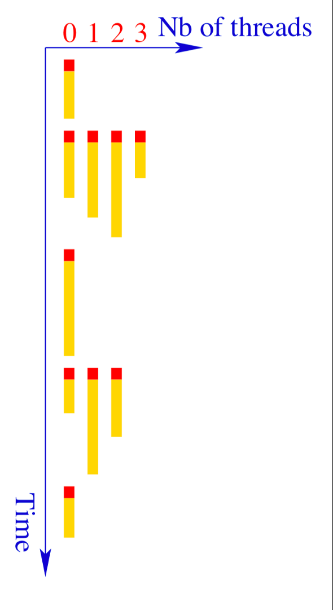
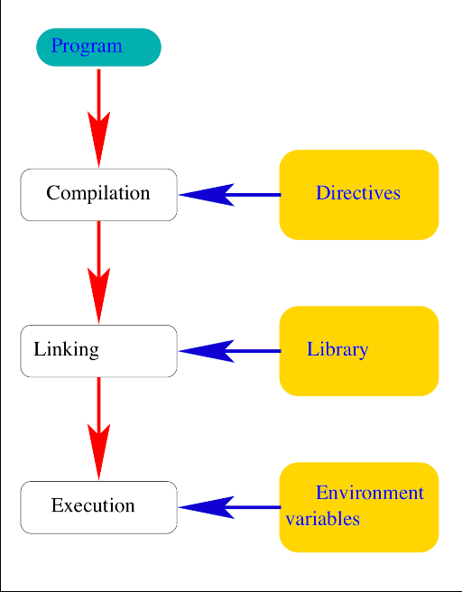

# Programming with OpenMP

OpenMP is the simplest way to parallelize an existing code on a single node. By
adding a few compiler directives to a serial program, you can distribute the
work over all the cores of a shared memory machine, without rewriting your
algorithms.

In this lecture, we will:

- review the shared memory and distributed memory paradigms

- understand the general concepts of OpenMP: threads, parallel regions, private
  and shared variables

- learn how to compile and run an OpenMP program

- parallelize loops and choose a work scheduling strategy

- learn best practices to get good performance with OpenMP

## Parallel programming languages

Evolution of programming methods:

- MPI is still the dominant programming technique.

- The hybrid OpenMP/MPI approach is the most effective on supercomputers.

- GPU programming is developing quickly:
  - CUDA
  - OpenACC and OpenMP
  - Message passing directly within the GPU

- New specific parallel programming languages are being developed:
  - Co-array Fortran, PGAS, X10, Chapel...

- New runtime systems handle task-based parallelism:
  - Charm++, HPX, Kokkos

### Distributed memory versus shared memory

- MPI uses a **distributed memory** paradigm: data are transferred explicitly
  between nodes through the network.

- OpenMP uses a **shared memory** paradigm: data are shared implicitly within
  the node through the Random-Access Memory.


## OpenMP history

### Multi-threading using directives

During the era of vector processing (mid-90s), many vendors (Cray, NEC, IBM...)
were using their own multi-threading directives. On October 28th 1997, they all
met and adopted the Open Multi-Processing standard. OpenMP is specified by the
Architecture Review Board (ARB).

- OpenMP 2.0 (November 2000): modern Fortran constructs

- OpenMP 3.0 (May 2008): task-based computing

- OpenMP 4.0 (July 2013): external devices (accelerators)

- OpenMP 5.0 (November 2018), followed by 5.1, 5.2, and 6.0 (November 2024)

## General concepts

### Multi-threading



- An OpenMP program is executed by only one process, called the master thread.
  The corresponding piece of code is called a **sequential region**.

- The master thread activates light-weight processes, called the workers or
  slave threads. This marks in the code the entry of a **parallel region**.

- Each thread executes a task corresponding to a block of instructions. During
  the execution of the task, variables can be read from or updated in memory.

- A variable can be defined in the local memory of the thread, called the stack
  memory. The variable is then called a **private variable**.

- A variable can be defined in the main shared (RAM) memory, also called the
  heap. The variable is then called a **shared variable**.

### Compilation



An OpenMP program relies on three ingredients:

- **Compilation directives and clauses**
  - They are put in the program to create the threads, define the work and data
    sharing strategy, and synchronize shared variables.
  - They are considered by the C, C++ or Fortran compilers as mere comment lines
    unless one specifies `-fopenmp` (or `-qopenmp` for the Intel compilers) on
    the compilation command line.

- **Functions and routines**
  - OpenMP contains several dedicated functions (like MPI). They are part of the
    OpenMP library that is linked at link time.

- **Environment variables**
  - OpenMP has several environment variables that can be set at execution time
    to change the parallel computing behavior.

Example:

```sh
$ gfortran -fopenmp prog.f90
$ ifx -qopenmp prog.f90
$ export OMP_NUM_THREADS=4
```

## Parallel region

### Shared variables

- In a parallel region, by default, the data sharing attribute of variables is
  shared.

- Within a single parallel region, all concurrent threads execute the same code
  in parallel.

- There is an implicit synchronization barrier at the end of the parallel
  region.

```fortran
program parallel
  !$ use OMP_LIB
  implicit none
  real    :: a
  logical :: p

  a = 92290. ; p=.false.
  !$OMP PARALLEL
  !$ p = OMP_IN_PARALLEL()
  print *,"A = ",a, &
          "; p = ",p
  !$OMP END PARALLEL
end program parallel
```

```sh
$ gfortran -fopenmp prog.f90
$ export OMP_NUM_THREADS=4
$ ./a.out
 A =    92290.0000     ; p =  T
 A =    92290.0000     ; p =  T
 A =    92290.0000     ; p =  T
 A =    92290.0000     ; p =  T
```

Lines starting with `!$` are only compiled when OpenMP is enabled. This is
called conditional compilation: without `-fopenmp`, the code above is still a
valid serial program.

### Private variables

- Using the `DEFAULT` clause, it is possible to change the default attribute to
  `PRIVATE`.

- If a variable is `PRIVATE`, it will be stored in the stack memory of each
  thread. Its value is undetermined when entering the parallel region.

```fortran
program parallel
  implicit none
  real :: a

  a = 92000.
  !$OMP PARALLEL DEFAULT(PRIVATE)
    a = a + 290.
    print *,"A = ",a
  !$OMP END PARALLEL
end program parallel
```

```sh
$ gfortran -fopenmp prog.f90
$ export OMP_NUM_THREADS=4
$ ./a.out
 A =    290.000000
 A =    290.000000
 A =    290.000000
 A =               NaN
```

The value 92000 set before the parallel region is lost: each thread starts from
an uninitialized copy of `a`, which here happened to contain 0 or `NaN`.

- Using the `FIRSTPRIVATE` clause, it is possible to force the initialization of
  a `PRIVATE` variable to the last value it had outside the parallel region.

```fortran
program parallel
  implicit none
  real :: a

  a = 92000.
  !$OMP PARALLEL DEFAULT(NONE) &
  !$OMP FIRSTPRIVATE(a)
    a = a + 290.
    print *,"A = ",a
  !$OMP END PARALLEL
  print*,"Out of region, A =",a
end program parallel
```

```sh
$ gfortran -fopenmp prog.f90
$ export OMP_NUM_THREADS=4
$ ./a.out
 A =    92290.0000
 A =    92290.0000
 A =    92290.0000
 A =    92290.0000
 Out of region, A =   92000.0000
```

### Number of threads

- The `NUM_THREADS()` clause sets the number of threads in a parallel region.

- `OMP_GET_NUM_THREADS()` gives the size of the active team.

```fortran
program parallel
  implicit none

  !$OMP PARALLEL NUM_THREADS(2)
    print *,"Hello !"
  !$OMP END PARALLEL

  !$OMP PARALLEL NUM_THREADS(3)
    print *,"Hi !"
  !$OMP END PARALLEL
end program parallel
```

```sh
$ gfortran -fopenmp prog.f90
$ export OMP_NUM_THREADS=4
$ ./a.out
 Hello !
 Hello !
 Hi !
 Hi !
 Hi !
```

## Parallel loop

### Work decomposition

- A parallel loop is a do-loop where each iteration is independent from the
  others.

- The work is decomposed by distributing the loop iterations among the threads.

- The parallel loop is the one that follows immediately after a `DO` directive.

- Loop indices are always private integer variables.

- Loops without loop indices or while loops are not supported by OpenMP.

### Work scheduling

- The distribution strategy is set by a `SCHEDULE` clause.

- Proper scheduling can optimize the load-balancing of the work.

- By default, the runtime sets a global synchronization at the end of the loop.

- The `NOWAIT` clause can remove the barrier.

- One can put many `DO` directives inside a `PARALLEL` region.

### Examples

With the default scheduling, the $n = 4096$ iterations are divided into 4
contiguous chunks of 1024 iterations, one per thread:

```fortran
program parallel
  !$ use OMP_LIB
  implicit none
  integer, parameter :: n=4096
  real,dimension(n) :: a
  integer :: i, rank, nb_threads

  !$OMP PARALLEL PRIVATE(rank,nb_threads)
  rank=OMP_GET_THREAD_NUM()
  nb_threads=OMP_GET_NUM_THREADS()
  !$OMP DO
  do i=1,n
     print*,rank,i
     a(i) = 92290. + real(i)
  end do
  !$OMP END DO
  !$OMP END PARALLEL

end program parallel
```

```sh
$ gfortran -fopenmp prog.f90
$ export OMP_NUM_THREADS=4
$ ./a.out | more
           1        1025
           0           1
           3        3073
           2        2049
           1        1026
           0           2
           3        3074
           2        2050
...
```

With a `STATIC` schedule and a chunk size of 128, the iterations are distributed
in a round-robin fashion by blocks of 128:

```fortran
  !$OMP DO SCHEDULE(STATIC,128)
  do i=1,n
     print*,rank,i
     a(i) = 92290. + real(i)
  end do
  !$OMP END DO
```

```sh
$ ./a.out | more
           2         257
           0           1
           1         129
           3         385
           2         258
           0           2
           1         130
           3         386
...
```

With a `RUNTIME` schedule, the strategy is chosen at execution time with the
`OMP_SCHEDULE` environment variable. Here, a `GUIDED` schedule starts with large
chunks and decreases their size down to a minimum of 16:

```fortran
  !$OMP DO SCHEDULE(RUNTIME)
  do i=1,n
     print*,rank,i
     a(i) = 92290. + real(i)
  end do
  !$OMP END DO
```

```sh
$ export OMP_SCHEDULE="GUIDED,16"
$ ./a.out | more
           0           1
           2        1025
           3        1793
           1        2369
           0           2
           2        1026
           3        1794
           1        2370
...
```

## Synchronization and reductions

### Reductions

- In a parallel loop, if one needs to perform a global operation, one uses the
  `REDUCTION` clause.

- Supported operations are
  - logical: `.AND.`, `.OR.`, `.EQV.`, `.NEQV.`
  - intrinsic: `MAX`, `MIN`, `IAND`, `IOR`, `IEOR`
  - arithmetic: `+`, `*`, `-`

- Each thread computes partial results, which are combined at the end of the
  parallel loop.

```fortran
program parallel
  implicit none
  integer, parameter :: n=5
  integer            :: i, s=0, p=1, r=1
  !$OMP PARALLEL
  !$OMP DO REDUCTION(+:s) REDUCTION(*:p,r)
    do i = 1, n
      s = s + 1
      p = p * 2
      r = r * 3
    end do
  !$OMP END PARALLEL
  print *,"s =",s, "; p =",p, "; r =",r
end program parallel
```

### Barriers and race conditions

- The directive `!$OMP BARRIER` forces the synchronization of all threads within
  a parallel region.

- The directives `ATOMIC` and `CRITICAL` can be used to force a serial variable
  update and avoid race conditions.

## Best practices

- Minimize the number of parallel regions in the code.

- Adjust the number of threads to the size of the problem (threads come with
  overhead).

- Always parallelize the outermost loop, on the slowest-varying index of an
  array (non-consecutive in memory).

- Conflicts between threads can lead to poor cache memory management (the
  so-called cache misses). Level 1 and 2 cache memory management is key to
  OpenMP performance.

- Performance analysis with OpenMP can be done using several functions provided
  by `OMP_LIB` to measure time. The most useful is `time = OMP_GET_WTIME()`,
  which gives the elapsed time in seconds.

### Memory placement

- The performance of your code will depend on the architecture. Be aware of
  "false" shared memory architectures!

- On most present day machines, local cache memory is faster than main RAM
  memory.

- Mapping your data in memory is a key performance factor.

- On Linux, the memory is mapped to a given socket on a "first touch" basis.
  This is very important for "Non-Uniform Memory Access" (NUMA) machines, for
  which the main memory is not really shared but distributed across the node.
