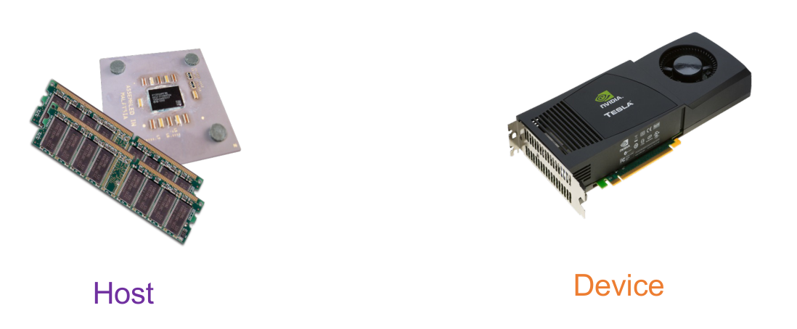
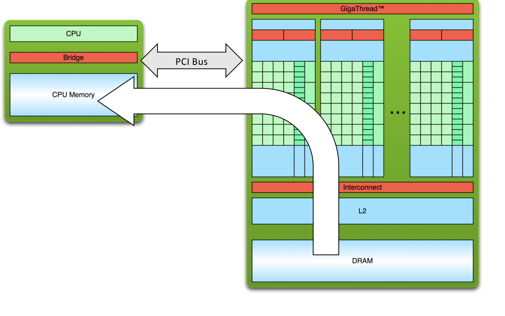
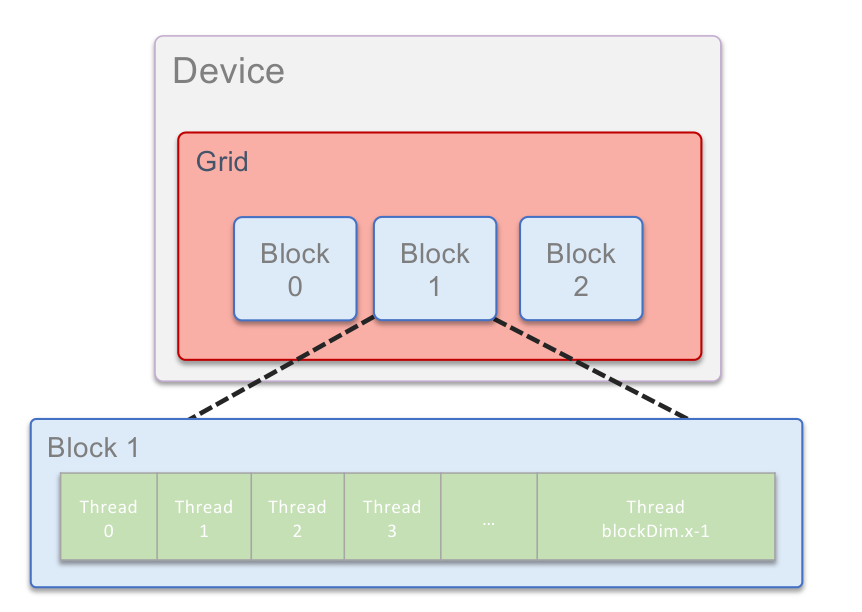
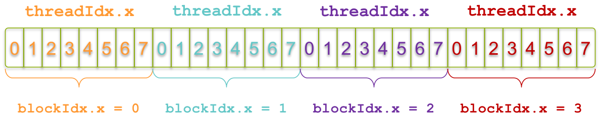
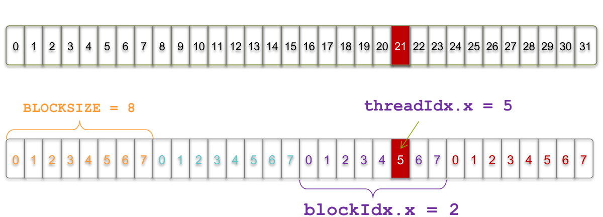
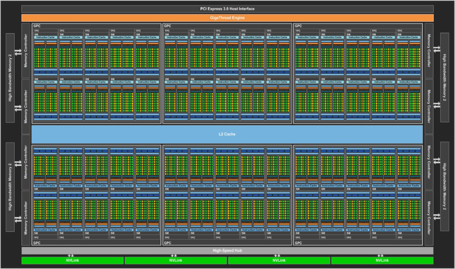
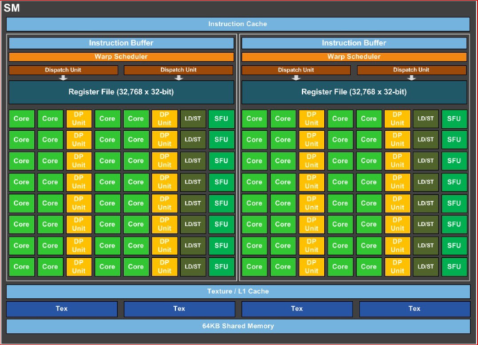
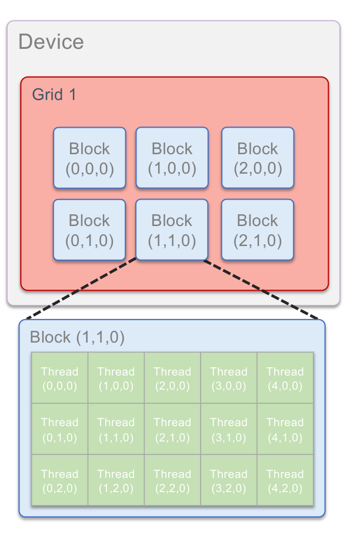

# Programming GPUs with CUDA

CUDA is NVIDIA's platform for parallel programming on Graphics Processing Units
(GPUs). It exposes the massive parallelism of the GPU to scientific computing,
with the goal of delivering high performance for scientific applications.

CUDA C/C++ and CUDA Fortran are based on the industry-standard C/C++ and Fortran
languages, with:

- a small set of extensions to enable heterogeneous programming

- straightforward APIs to manage devices, memory, etc.

In this lecture, we will:

- start from "Hello World!"

- write and launch CUDA C/C++ kernels

- manage GPU memory

- manage communication and synchronization

## Heterogeneous computing

### Terminology

- **Host**: the CPU and its memory (host memory).

- **Device**: the GPU and its memory (device memory).



A CUDA program mixes **serial code**, which runs on the host, and **parallel
code**, which runs on the device. The parallel functions executed on the device
are called **kernels**. Here is a complete example, which we will build up step
by step in this lecture:

```c
#include <cuda.h>
#include <stdio.h>
#include <stdlib.h>

#define N 100000
#define M 256

// parallel function
__global__ void add(int *a, int *b, int *c) {
  int index = threadIdx.x + blockIdx.x * blockDim.x;
  if (index < N)
    c[index] = a[index] + b[index];
}

void random_ints(int *x, int size) {
  int i;
  for (i = 0; i < size; i++) x[i] = rand() % 10;
}

int main(void) {
  int *a, *b, *c;        // host copies of a, b, c
  int *a_d, *b_d, *c_d;  // device copies of a, b, c
  int size = N * sizeof(int);

  // Alloc space for device copies of a, b, c
  cudaMalloc((void **)&a_d, size);
  cudaMalloc((void **)&b_d, size);
  cudaMalloc((void **)&c_d, size);

  // Alloc space for host copies of a, b, c and setup input values
  a = (int *)malloc(size); random_ints(a, N);
  b = (int *)malloc(size); random_ints(b, N);
  c = (int *)malloc(size);

  // Copy inputs to device
  cudaMemcpy(a_d, a, size, cudaMemcpyHostToDevice);
  cudaMemcpy(b_d, b, size, cudaMemcpyHostToDevice);

  // Launch add() kernel on GPU (parallel code)
  add<<<(N + M - 1) / M, M>>>(a_d, b_d, c_d);

  // Copy result back to host
  cudaMemcpy(c, c_d, size, cudaMemcpyDeviceToHost);

  // Cleanup
  free(a); free(b); free(c);
  cudaFree(a_d); cudaFree(b_d); cudaFree(c_d);
  return 0;
}
```

### Simple processing flow



The CPU and the GPU are connected through the PCI bus. A typical GPU computation
proceeds in three steps:

1. Copy input data from CPU memory to GPU memory.

2. Load the GPU program and execute it, caching data on chip for performance.

3. Copy results from GPU memory back to CPU memory.

Transfers over the PCI bus are slow compared to the GPU memory bandwidth, so a
good GPU code minimizes the data movement between host and device.

## Hello World!

### Host code only

```c
#include <stdio.h>

int main(void) {
  printf("Hello World!\n");
  return 0;
}
```

```sh
$ nvcc hello_world.cu
$ ./a.out
Hello World!
```

This is standard C (or Fortran) that runs on the host. The NVIDIA compilers
(`nvcc` or `nvfortran`) can also be used to compile programs with no device
code.

### Hello World! with device code

```c
#include <stdio.h>

__global__ void mykernel(void) {}

int main(void) {
  mykernel<<<1, 1>>>();
  printf("Hello World!\n");
  return 0;
}
```

There are two new syntactic elements here. First, the `__global__` keyword
indicates a function, called a **kernel**, that:

- runs on the device

- is called from the host

`nvcc` separates the source code into host and device components:

- device functions (e.g. `mykernel()`) are processed by the NVIDIA compiler

- host functions (e.g. `main()`) are processed by the standard host compiler,
  for example `gcc`

Second, the call `mykernel<<<1,1>>>()`:

- Triple angle brackets mark a call from host code to device code. This is also
  called a **kernel launch**.

- The arguments inside the brackets correspond to
  `<<<blocks, threads_per_block>>>`. We will return to this terminology later.

That's all that is required to execute a function on the GPU!

```sh
$ nvcc hello.cu
$ ./a.out
Hello World!
```

So far, `mykernel()` does nothing. Let's write a parallel code.

## Parallel programming in CUDA

GPU computing is about massive parallelism. We will start by adding two integers
and build up to adding two vectors $c = a + b$.

### Addition on the device

A simple kernel to add two integers:

```c
__global__ void add(int *a, int *b, int *c) {
  *c = *a + *b;
}
```

As before, `__global__` is a CUDA keyword meaning that:

- `add()` will be executed on the device

- `add()` will be called from the host

Note that we use pointers for the variables. Because `add()` runs on the device,
`a`, `b` and `c` must point to device memory. In other words, we need to
allocate memory on the GPU.

### Memory management

Host and device memory are separate entities:

- **Device** pointers point to GPU memory. They may be passed to and from host
  code, but may _not_ be dereferenced in host code.

- **Host** pointers point to CPU memory. They may be passed to and from device
  code, but may _not_ be dereferenced in device code.

CUDA provides a simple API for handling device memory: `cudaMalloc()`,
`cudaFree()` and `cudaMemcpy()`. They are similar to their C equivalents
`malloc()`, `free()` and `memcpy()`.

### Addition on the device: `main()`

```c
int main(void) {
  int a, b, c;           // host copies of a, b, c
  int *a_d, *b_d, *c_d;  // device copies of a, b, c
  int size = sizeof(int);

  // Allocate space for device copies of a, b, c
  cudaMalloc((void **)&a_d, size);
  cudaMalloc((void **)&b_d, size);
  cudaMalloc((void **)&c_d, size);

  // Setup input values
  a = 2;
  b = 7;

  // Copy inputs to device
  cudaMemcpy(a_d, &a, size, cudaMemcpyHostToDevice);
  cudaMemcpy(b_d, &b, size, cudaMemcpyHostToDevice);

  // Launch add() kernel on GPU
  add<<<1, 1>>>(a_d, b_d, c_d);

  // Copy result back to host
  cudaMemcpy(&c, c_d, size, cudaMemcpyDeviceToHost);

  // Print the result
  printf("c = %d\n", c);

  // Cleanup
  cudaFree(a_d); cudaFree(b_d); cudaFree(c_d);
  return 0;
}
```

We use the suffix `_d` to identify pointers to device memory. This naming
convention is not required by CUDA, but it helps avoid dereferencing a device
pointer in host code by mistake.

## Moving to parallel

### Parallel blocks

So how do we run code in parallel on the device? Instead of executing `add()`
once:

```c
add<<<1, 1>>>();
```

we execute it `N` times in parallel:

```c
add<<<N, 1>>>();
```

With `add()` running in parallel, we can do vector addition:

- Terminology: each parallel invocation of `add()` is referred to as a
  **block**.

- The set of blocks is referred to as a **grid**.

- Each invocation can refer to its block index using `blockIdx.x`.

```c
__global__ void add(int *a, int *b, int *c) {
  c[blockIdx.x] = a[blockIdx.x] + b[blockIdx.x];
}
```

By using `blockIdx.x` to index into the array, each block handles a different
index. On the device, each block can be executed in parallel:

| Block 0             | Block 1             | Block 2             | Block 3             |
| ------------------- | ------------------- | ------------------- | ------------------- |
| `c[0] = a[0]+b[0];` | `c[1] = a[1]+b[1];` | `c[2] = a[2]+b[2];` | `c[3] = a[3]+b[3];` |

### Vector addition on the device: `main()`

```c
#define N 512

int main(void) {
  int *a, *b, *c;        // host copies of a, b, c
  int *a_d, *b_d, *c_d;  // device copies of a, b, c
  int size = N * sizeof(int);

  // Alloc space for device copies of a, b, c
  cudaMalloc((void **)&a_d, size);
  cudaMalloc((void **)&b_d, size);
  cudaMalloc((void **)&c_d, size);

  // Alloc space for host copies of a, b, c and setup input values
  a = (int *)malloc(size); random_ints(a, N);
  b = (int *)malloc(size); random_ints(b, N);
  c = (int *)malloc(size);

  // Copy inputs to device
  cudaMemcpy(a_d, a, size, cudaMemcpyHostToDevice);
  cudaMemcpy(b_d, b, size, cudaMemcpyHostToDevice);

  // Launch add() kernel on GPU with N blocks
  add<<<N, 1>>>(a_d, b_d, c_d);

  // Copy result back to host
  cudaMemcpy(c, c_d, size, cudaMemcpyDeviceToHost);

  // Cleanup
  free(a); free(b); free(c);
  cudaFree(a_d); cudaFree(b_d); cudaFree(c_d);
  return 0;
}
```

### Recapitulation

- Difference between host and device:
  - Host: CPU
  - Device: GPU

- Using `__global__` to declare a function as device code:
  - executes on the device
  - is called from the host

- Passing parameters from host code to a device function.

- Basic device memory management:
  - `cudaMalloc()`
  - `cudaMemcpy()`
  - `cudaFree()`

- Launching parallel kernels:
  - launch `N` copies of `add()` with `add<<<N,1>>>(...);`
  - use `blockIdx.x` to access the block index

## CUDA threads

Terminology: a block can be split into parallel **threads**. Let's change
`add()` to use parallel threads instead of parallel blocks. We use `threadIdx.x`
instead of `blockIdx.x`:

```c
__global__ void add(int *a, int *b, int *c) {
  c[threadIdx.x] = a[threadIdx.x] + b[threadIdx.x];
}
```

We need to make only one change in `main()`, the kernel launch:

```c
// Launch add() kernel on GPU with N threads
add<<<1, N>>>(a_d, b_d, c_d);
```

The rest of `main()` is identical to the previous version.

## Combining blocks and threads

We have seen parallel vector addition using:

- many blocks with one thread each: `add<<<N,1>>>`

- one block with many threads: `add<<<1,N>>>`

Let's adapt vector addition to use the full parallel power of the device by
incorporating both blocks and threads. We start with data indexing.

### Indexing

A kernel is launched as a **grid** of **blocks** of **threads**.



CUDA provides the following built-in variables:

| Variable      | Meaning                          |
| ------------- | -------------------------------- |
| `threadIdx.x` | Thread index inside the block    |
| `blockIdx.x`  | Block index                      |
| `blockDim.x`  | Number of threads per block      |
| `gridDim.x`   | Number of blocks in the grid     |

### Indexing arrays

Indexing is no longer as simple as using `blockIdx.x` or `threadIdx.x`. Consider
indexing an array with one element per thread, with 8 threads per block:



With 8 threads per block, a unique index for each thread is given by:

```c
int index = threadIdx.x + blockIdx.x * 8;
```

Which thread will operate on the red element below?



```c
int index = threadIdx.x + blockIdx.x * BLOCKSIZE;
//        =      5      +     2      * 8;
//        = 21;
```

### Vector addition with blocks and threads

Instead of hard-coding the block size, we use the built-in variable `blockDim.x`
for the number of threads per block:

```c
int index = threadIdx.x + blockIdx.x * blockDim.x;
```

The combined version of `add()` uses parallel threads _and_ parallel blocks:

```c
__global__ void add(int *a, int *b, int *c) {
  int index = threadIdx.x + blockIdx.x * blockDim.x;
  c[index] = a[index] + b[index];
}
```

What changes need to be made in `main()`?

```c
#define N (2048 * 2048)
#define BLOCKSIZE 512

int main(void) {
  int *a, *b, *c;        // host copies of a, b, c
  int *a_d, *b_d, *c_d;  // device copies of a, b, c
  int size = N * sizeof(int);

  // Alloc space for device copies of a, b, c
  cudaMalloc((void **)&a_d, size);
  cudaMalloc((void **)&b_d, size);
  cudaMalloc((void **)&c_d, size);

  // Alloc space for host copies of a, b, c and setup input values
  a = (int *)malloc(size); random_ints(a, N);
  b = (int *)malloc(size); random_ints(b, N);
  c = (int *)malloc(size);

  // Copy inputs to device
  cudaMemcpy(a_d, a, size, cudaMemcpyHostToDevice);
  cudaMemcpy(b_d, b, size, cudaMemcpyHostToDevice);

  // Launch add() kernel on GPU
  add<<<N / BLOCKSIZE, BLOCKSIZE>>>(a_d, b_d, c_d);

  // Copy result back to host
  cudaMemcpy(c, c_d, size, cudaMemcpyDeviceToHost);

  // Cleanup
  free(a); free(b); free(c);
  cudaFree(a_d); cudaFree(b_d); cudaFree(c_d);
  return 0;
}
```

### Handling arbitrary vector sizes

Typical problems are not friendly multiples of `blockDim.x`. We need to avoid
accessing beyond the end of the arrays:

```c
__global__ void add(int *a, int *b, int *c, int n) {
  int index = threadIdx.x + blockIdx.x * blockDim.x;
  if (index < n)
    c[index] = a[index] + b[index];
}
```

and update the kernel launch to round the number of blocks up:

```c
add<<<(N + BLOCKSIZE - 1) / BLOCKSIZE, BLOCKSIZE>>>(a_d, b_d, c_d, N);
```

### Why bother with threads and blocks?

Using both threads and blocks seems unnecessarily complicated: they add a level
of complexity. What do we gain?

Unlike parallel blocks, threads have mechanisms to:

- communicate

- synchronize

To understand why, we need to look at the hardware.

## GPU architecture

### Pascal P100

As an example, we consider the NVIDIA Pascal P100, a GPU designed for High
Performance Computing. The chip is organized into many
**Streaming Multiprocessors** (SMs), connected to a shared L2 cache and to the
high-bandwidth device memory:



### Streaming Multiprocessor (SM)



Each SM contains many cores, organized in groups of 32 called **warps**. The
software hierarchy maps onto this hardware hierarchy:

- an **SM** is made of warps, each warp of 32 cores

- a **block** is made of warps, each warp of 32 threads

### Terminology

| Concept    | Description                                                                                                         |
| ---------- | ------------------------------------------------------------------------------------------------------------------- |
| **Thread** | Each thread is executed by one core.                                                                                |
| **Warp**   | A warp consists of 32 cores that share the register memory and operate simultaneously by construction.              |
| **Block**  | Each block is assigned to one SM and consists of warps. The threads of a block share the SM's 64 KB on-chip memory. |
| **Grid**   | The kernel is executed over a grid of blocks.                                                                       |

This explains why threads within a block can communicate and synchronize: they
run on the same SM and share its fast on-chip memory. Blocks, on the other hand,
may run on different SMs, in any order.

### Recapitulation

What have we learned?

- Write and launch CUDA kernels:
  - `__global__`, `<<<blocks, threads_per_block>>>`
  - `threadIdx.x`, `blockIdx.x`, `blockDim.x`

- Manage GPU memory:
  - `cudaMalloc()`, `cudaMemcpy()`, `cudaFree()`

## Extra topics

### Coordinating host and device

Kernel launches are **asynchronous**: control returns to the host immediately.
The host needs to synchronize before consuming the results.

| Function                  | Behavior                                                                                                                  |
| ------------------------- | ------------------------------------------------------------------------------------------------------------------------- |
| `cudaMemcpy()`            | Blocks the host until the copy is complete. The copy begins when all preceding kernel calls have completed.               |
| `cudaMemcpyAsync()`       | Asynchronous, does not block the host.                                                                                    |
| `cudaDeviceSynchronize()` | Blocks the host until all preceding kernel calls have completed.                                                          |

### Reporting errors

All CUDA API calls return an error code (`cudaError_t`). This error can come
from:

- the API call itself, or

- an earlier asynchronous operation (e.g. a kernel).

Get the error code for the last error:

```c
cudaError_t cudaGetLastError(void);
```

Get a string to describe the error:

```c
char *cudaGetErrorString(cudaError_t);
```

For example:

```c
printf("%s\n", cudaGetErrorString(cudaGetLastError()));
```

### 3D indexing

A kernel is launched as a grid of blocks of threads, and `blockIdx` and
`threadIdx` are in fact 3D. So far, we showed only one dimension (`x`).



The built-in variables are:

| Variable    | Meaning                              |
| ----------- | ------------------------------------ |
| `threadIdx` | Thread indices `(x, y, z)`           |
| `blockIdx`  | Block indices `(x, y, z)`            |
| `blockDim`  | Number of threads per block `(x, y, z)` |
| `gridDim`   | Number of blocks `(x, y, z)`         |

### Sharing data between threads

Terminology: within a block, threads share data via **shared memory**:

- extremely fast on-chip memory, managed by the user

- declared using `__shared__`, allocated per block

- data is not visible to threads in other blocks

### Thread synchronization

```c
void __syncthreads();
```

- Synchronizes all threads within a block. It is used to prevent race condition
  hazards.

- All threads must reach the barrier. In conditional code, the condition must be
  uniform across the block.

For example, the following kernel computes the sum of the elements handled by
each block. Each thread first copies one element into shared memory, then the
threads cooperate to reduce the shared array, with a barrier between each step:

```c
#define BLOCKSIZE 512

__global__ void block_sum(int *in, int *out, int n) {
  __shared__ int temp[BLOCKSIZE];
  int index = threadIdx.x + blockIdx.x * blockDim.x;

  // Copy one element per thread into shared memory
  temp[threadIdx.x] = (index < n) ? in[index] : 0;
  __syncthreads();

  // Tree reduction within the block
  for (int stride = blockDim.x / 2; stride > 0; stride /= 2) {
    if (threadIdx.x < stride)
      temp[threadIdx.x] += temp[threadIdx.x + stride];
    __syncthreads();
  }

  // Thread 0 writes the partial sum of this block
  if (threadIdx.x == 0)
    out[blockIdx.x] = temp[0];
}
```

Note that `__syncthreads()` is called outside the `if` statements, so that every
thread of the block reaches the barrier.

### Device management

An application can query and select GPUs:

```c
cudaGetDeviceCount(int *count);
cudaSetDevice(int device);
cudaGetDevice(int *device);
cudaGetDeviceProperties(cudaDeviceProp *prop, int device);
```

- Multiple host threads can share a device.

- A single host thread can manage multiple devices, using `cudaSetDevice(i)` to
  select the current device.
