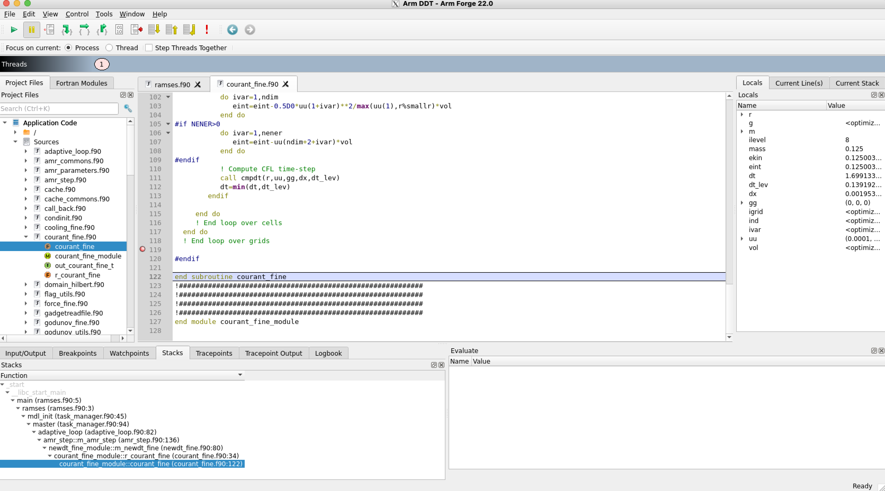

# Debugging

Debugging is one of the most painful and addictive activity in software
engineering. One could compare it to running or sudoku. You suffer for hours
trying to understand why your code is crashing, and when you find the bug, the
prize is a dopamine rush and a working code.

In this lecture, we will:

- give an overview of the debugging process

- learn tips and tricks from a lifelong experience in debugging

- gain practical knowledge in

  - simple debugging techniques using compilers
  - simple debuggers for C/C++, Rust, and Python
  - more advanced graphical debuggers

## Overview of the debugging process

### Debugging is not easy

When a code crashes it usually writes out a cryptic error message

- The cpu processes machine instructions, not the C or Rust source code that
  you wrote...

- Instructions in the final executable program have probably been rearranged for
  optimization purposes

- You are in luck if the error happens at the beginning of the execution...
  usually it does not!

- In a large parallel code, how many processes triggered the problem? 1, 2, all
  of them? Was it related to inter-process communication?

### Typical error messages

- `SIGFPE`: floating point exception

  - Often controlled by compiler options
  - division by zero
  - square root of a negative number
  - log of a number less or equal to zero

- Does not always crash your code! (depends on compilation and system settings)
- The code can keep going for a long time with `NaN` or `inf` values

- `SIGSEGV`: segmentation violation (see “man 7 signal”)
  - invalid memory reference!e.g. trying to access an array element outside the
    dimensions of an array

Example:

```c
double x[100];
x[345] = 0; // SIGSEGV
```

This and other kinds of memory issues are entirely avoided in Rust due to the thorough checks that are done at compile time (and run time).

```rust
let mut x = [0f64; 100];
x[345] = 0.0; // fails to compile

let mut x = vec![0f64; 100];
x[345] = 0.0; // panics at run-time
```

- Make sure your shell “stack size limit” and "core size limit" are both set to
  “unlimited”

  - `ulimit -s unlimited` set stack memory to unlimited
  - `ulimit -c unlimited` set core file size to unlimited
  - `ulimit -a` show all limits

- I/O errors
  - File already exists
  - File doesn't exist
  - No space left on disk
    - `checkquota` will check for memory and inodes overflow

```
$ checkquota
          Storage/size quota filesystem report for user: rt3504
Filesystem             Mount              Used   Limit  MaxLim Comment
Stellar home           /home             4.8GB    93GB   100GB
Stellar scratch GPFS   /scratch/gpfs    29.1TB  34.2TB    35TB
Tigress GPFS           /tigress          3.8TB   9.8TB    10TB

Fileset/project space            Mount                Used by ALL By rt3504  MaxLim Comment
Projects GPFS fileset TEYSSIER   /projects/TEYSSIER           0KB         0     5TB

          Storage number of files used report for user: rt3504
Filesystem             Mount              Used   Limit  MaxLim Comment
Stellar home           /home             54.8K    952K    1.0M
Stellar scratch GPFS   /scratch/gpfs      2.3M    3.0M      3M
Tigress GPFS           /tigress         364.7K       0       0

Fileset/project space            Mount                Used by ALL By rt3504  MaxLim Comment
Projects GPFS fileset TEYSSIER   /projects/TEYSSIER             2         1    None

For quota increase requests please use this website:

         https://forms.rc.princeton.edu/quota
```

- NO ERROR MESSAGE AT ALL!
  - The code just hangs
  - Usually points to a communication deadlock in a parallel code
  - The results are just plain wrong
    - can be your fault (bug, race condition)
    - can be the system fault (MPI communication failure)

### Take advantage of the compiler options

- Take the time to go through all the options of the compiler that you use

- Pay particular attention to the diagnostics options under sections with names
  such as “debugging”, “optimization”, “target-specific”, “warnings”

- Using `man gcc` is a good start although most compilers now
  have detailed online documentation! Just check the company’s web site under
  “support” or “documentation”. For example, the documentation for `gcc` (GNU
  Compiler Collection) can be found [here](https://gcc.gnu.org).

### The `-g` compiler option

All compilers accept the `-g` option.

- It links the source code to the executed machine language code.

- The `-g` option is necessary when using a debugger unless you are REALLY good
  at deciphering machine language.

- However, using `-g` slows down the code significantly

- Removes optimizations (unless one uses `–gopt` or `–g –O3`)

- Start with `-g –O0` (no optimization) for most accurate correspondence between
  executable instructions and source code line

- Inserts a lot of extra information in the executable to help the debugging
  process

- Running with `-g` is sometimes sufficient to find a bug. The code crashes and
  indicates where the error occurred

- `cargo` defaults to compiling with the equivalent of `-g -O0`.

### The `-g` option makes the bug go away!

- Sometimes, the fact of using the `-g` option makes the bug go away

- This does not necessarily mean that the optimized code generated by the
  compiler is wrong, although it could be...

- It can point to a memory issue, such as a pointer accessing a bad memory
  address when the optimized code is executed

- Look at your compiler’s documentation for how you can use the `-g` option
  while keeping most of the optimizations intact, such as `-gopt` for the PGI
  compiler (Portland Group), or simply `-g –O2` for Intel
  - caveat: these solutions can sometimes point you to the wrong location in the
    source code

### Examples of useful compiler options

- All compilers have options that try to detect potential bugs in the code

  - Array bounds check (gcc: -Warray-bounds)
    - Check for array subscripts and substrings out of bounds
    - Should be done on unoptimized code (-O0)

- `rustc` is special since all warnings and checks are enabled by default.

### Warning options in `gcc`

- The gcc compiler has a large number of options that will produce a warning at
  compile time
  - They all start with `-W...`
  - Example: `-Wuninitialized` warns if an automatic variable is used before
    being initialized
  - `-Wall` turns on most of the gcc warning options
  - `-Werror` makes all warnings into errors
  - Different levels of debugging information with `–g1`, `–g2`, and `–g3`
  - See `man gcc`

### Try different compilers if you can

- Whenever you can, it is always a good idea to try different compilers if you
  have access to different plavorms or different compilers on the same platform

- Some compilers are a lot stricter than others and can catch potential problems
  at compile time

- See [this page](https://gcc.gnu.org/wiki/ClangDiagnosticsComparison) for
  comparison between GCC and Clang compilers in term of available diagnostics

### The code crashes... now what?!

- The first thing that you need to know is **where** the code stopped and
  **how** it got there

- Each time a program performs a function call, information about the call is
  generated. That information includes the location of the call in the program,
  the arguments of the call, and the local variables of the function being
  called

- This information is saved in a block of data called _stack frame_

- The stack frames are stored in a region of memory called the **call stack**

### Saving the stack in `core` files

- How can one view the stack if the code crashed?

- When a code crashes, the system (normally) saves the last call stack of the
  code in files named `core` (or `core.#`, where `#` is the rank number of an
  MPI task in a parallel code)

- No `core` file?

  - Check your shell limits: `ulimit –a` (bash) or `limit` (csh)
  - Look for `core file size` (bash) or `coredumpsize` (csh) > 0

- These files are binary files meant to be read by debuggers

- Of limited use if the code was not compiled with `–g` option that links machine
  language code to high-level source code

### Examining the call stack

- All debuggers should allow you to view the call stack, or simply stack

- Commands to look for in the debuggers
  - backtrace (gdb)
  - where
  - info stack

```
$ apropos debug
__after_morecore_hook (3) - malloc debugging variables
__free_hook (3)      - malloc debugging variables
__malloc_hook (3)    - malloc debugging variables
__malloc_initialize_hook (3) - malloc debugging variables
__memalign_hook (3)  - malloc debugging variables
__realloc_hook (3)   - malloc debugging variables
_nc_tracebits (3x)   - curses debugging routines
_traceattr (3x)      - curses debugging routines
_traceattr2 (3x)     - curses debugging routines
_tracecchar_t (3x)   - curses debugging routines
_tracecchar_t2 (3x)  - curses debugging routines
_tracechar (3x)      - curses debugging routines
_tracechtype (3x)    - curses debugging routines
_tracechtype2 (3x)   - curses debugging routines
_tracedump (3x)      - curses debugging routines
_tracef (3x)         - curses debugging routines
_tracemouse (3x)     - curses debugging routines
backtrace (3)        - support for application self-debugging
backtrace_symbols (3) - support for application self-debugging
backtrace_symbols_fd (3) - support for application self-debugging
BIO_debug_callback (3ssl) - BIO callback functions
CPAN::Debug (3pm)    - internal debugging for CPAN.pm
CRYPTO_mem_debug_pop (3ssl) - Memory allocation functions
CRYPTO_mem_debug_push (3ssl) - Memory allocation functions
CRYPTO_set_mem_debug (3ssl) - Memory allocation functions
CURLOPT_DEBUGDATA (3) - custom pointer for debug callback
CURLOPT_DEBUGFUNCTION (3) - debug callback
curs_trace (3x)      - curses debugging routines
DB (3pm)             - programmatic interface to the Perl debugging API
dbus-monitor (1)     - debug probe to print message bus messages
debugfs (8)          - ext2/ext3/ext4 file system debugger
debuginfod-client-config (7) - debuginfod client environment variables, cache...
debuginfod-find (1)  - request debuginfo-related data
dftest (1)           - Shows display filter byte-code, for debugging dfilter ...
dnf-debug (8)        - DNF debug Plugin
dnf-debuginfo-install (8) - DNF debuginfo-install Plugin
error::dwarf (7stap) - dwarf debuginfo quality problems
gnutls-cli-debug (1) - GnuTLS debug client
FcPatternPrint (3)   - Print a pattern for debugging
gdb (1)              - The GNU Debugger
```

- Use the `apropos debug` command on your UNIX-based platform to find out which
  debugger is available

- If working on Linux (most cases), `gdb` should be available

### The `gdb` debugger

- Official GNU debugger available under Linux

- Widely used for C and C++ code debugging

- Can also be used with Rust out of the box, but `cargo` comes preinstalled with a `rust-gdb` wrapper that makes printouts look nicer.

- Online manual for gdb at `info gdb`

- Can be used within the `emacs` editor

  - Can run gdb commands within the emacs source code window (e.g. `C-x SPC` to
    set a breakpoint)

- See also Visual Studio

- Online manual can be found [here](https://www.sourceware.org/gdb/current/).

- If code was compiled with `–g` and _dumped core files_ when it crashed, the
  first thing to try is the following:

```sh
$ gdb executable core.#
(gdb) where (or backtrace, or bt)
```

- The `where` command prints out the call stack

- You can also use the DDT advanced debugger to open the core file and view the
  call stack...

### Using `gdb`

- Compile with `-g -O0` to get accurate binary-to-source correspondence

- Start gdb: `gdb a.out`

- You get the (gdb) prompt, where you can type the commands:

| Command | Abbrev. | Description                                                                               |
| :------ | :------ | :---------------------------------------------------------------------------------------- |
| `help`  |         | List gdb command topics                                                                   |
| `run`   | `r`     | Start program execution                                                                   |
| `break` |         | Suspend execution at specific location (line number, function, instruction address, etc.) |
| `step`  | `s`     | Step to next line of code. Will step into a function if necessary                         |
| `next`  | `n`     | Execute next line of code. Will NOT enter functions                                       |
| `until` |         | Continue processing until it reaches a specified line                                     |
| `list`  | `l`     | List source code with current position of execution                                       |
| `print` | `p`     | Print value stored in a variable                                                          |

### The `gdb` debugger: a demo

Here is a simple example program in C++:

```cpp
// example.cpp
#include <iostream>

int main() {

  int arr[10];
  int i = 40;
  int x = 0;

  arr[i] = 2/x;
  std::cout << arr[i] << std::endl;

  return 0;
}
```

Now let's compile it with `g++` and run it:

```sh
$ g++ example.cpp -o example
$ ./example
  Program terminated with signal: SIGFPE
```

The compiler didn't catch the division by zero or the array index overflow. We can help the compiler a bit by pointing out that `i` and `x` are not going to change value during execution.

```cpp
// example.cpp
#include <iostream>

int main() {

  int arr[10];
  const int i = 40;
  const int x = 0;

  arr[i] = 2/x;
  std::cout << arr[i] << std::endl;

  return 0;
}
```

Let's try to compile it with `g++` again.

```sh
$ g++ example.cpp -o example
  example.cpp: In function 'int main()':
  example.cpp:10:13: warning: division by zero [-Wdiv-by-zero]
     10 |   arr[i] = 2/x;
        |            ~^~
```

Now we get a warning saying that there was a division by zero. Note that this corresponds to the `-Wdiv-by-zero` flag, which is enabled by default. However, it still compiled even though it detected an issue. Let's fix the issue by changing the line to `const int x = 1;`.

```sh
$ g++ example.cpp -o example
$ ./example
  2
```

Everything seems like it's working correctly. However, let's now try compiling it with `clang++`.

```sh
$ clang++ example.cpp -o example
  example.cpp:10:3: warning: array index 40 is past the end of the array (which contains 10 elements) [-Warray-bounds]
    arr[i] = 2/x;
    ^   ~
  example.cpp:6:3: note: array 'arr' declared here
    int arr[10];
    ^
  example.cpp:11:16: warning: array index 40 is past the end of the array (which contains 10 elements) [-Warray-bounds]
    std::cout << arr[i] << std::endl;
                 ^   ~
  example.cpp:6:3: note: array 'arr' declared here
    int arr[10];
    ^
  2 warnings generated.
```

This compiler was able to tell that we were accessing data past the end of the array. In this particular case the data we were accessing was still within the region of memory assigned to the program. Although the program didn't crash, we were corrupting memory which opens the door to numerous issues and vulnerabilities. Try using something like `const int i = 4000;` to see that it causes a segmentation violation. Let's fix this bug by changing the line to `const int i = 4;`.

The story in Rust is quite different. Let's use the same starting point.

```rust
// example.rs
fn main() {

  let mut arr = [0; 10];
  let i = 40;
  let x = 0;

  arr[i] = 2/x;
  println!("{}", arr[i]);
}
```

Let's try to compile it.

```sh
$ rustc example.rs
  error: this operation will panic at runtime
  --> example.rs:8:12
    |
  8 |   arr[i] = 2/x;
    |            ^^^ attempt to divide `2_i32` by zero
    |
    = note: `#[deny(unconditional_panic)]` on by default

  error: this operation will panic at runtime
  --> example.rs:8:3
    |
  8 |   arr[i] = 2/x;
    |   ^^^^^^ index out of bounds: the length is 10 but the index is 40

  error: this operation will panic at runtime
  --> example.rs:9:18
    |
  9 |   println!("{}", arr[i]);
    |                  ^^^^^^ index out of bounds: the length is 10 but the index is 40

  error: aborting due to 3 previous errors
```

In this case not only did it detect the issues, but it even refused to compile it.

Let's now use `gdb` with our fixed C++ code to look at what's happens step by step:

```sh
$ g++ -g example.cpp -o example
$ gdb ./example
  Reading symbols from ./example...done.
(gdb) b 6
  Breakpoint 1 at 0x40117e: file example.cpp, line 7.
(gdb) r
  Starting program: ./example...

  Breakpoint 1, main () at example.cpp:7
  7	  const int i = 4;
(gdb) p i
  $1 = 0
(gdb) s
  8	  const int x = 1;
(gdb) p i
  $2 = 4
(gdb) p x
  $3 = 0
(gdb) s
  10	  arr[i] = 2/x;
(gdb) p x
  $4 = 1
(gdb) s
  11	  std::cout << arr[i] << std::endl;
(gdb) p arr
  $5 = {-138376496, 32767, 0, 0, 2, 0, 4198544, 0, -44160, 32767}
(gdb) s
  2
  13	  return 0;
```

Using `gdb` with rust is very similar:

```sh
$ rustc -g example.rs
$ rust-gdb ./example
  Reading symbols from ./example...
(gdb) b 7
  Breakpoint 1 at 0xc072: file example.rs, line 8.
(gdb) r
  Starting program: ./example

  Breakpoint 1, example::main () at example.rs:8
  8	  arr[i] = 2/x;
(gdb) p i
  $1 = 4
(gdb) s
  9	  println!("{}", arr[i]);
(gdb) p arr
  $2 = [0, 0, 0, 0, 2, 0, 0, 0, 0, 0]
```

### I know where the code crashed... what's next?

- Detective work starts

- Try reducing the problem size and see if the error is still there

  - The smaller the better
  - Running with only 2 processes is ideal if your code is parallel

- Start your code in a debugger (gdb or other) and set a breakpoint on a line
  executed before the crash

- Examine the values of variables and arrays by printing them out or visualizing
  them (advanced debuggers)

- Step through your code line by line until you find the problem

- Set other breakpoints to jump over long sections of code, such as loops

- If you know which variable goes bad, use a conditional breakpoint to run
  `until` (gdb) the variable changes to a given value

- Visualizing the results coming out of the code may help detect problems
  - Grid problems are often detected by visual inspection of images and movies

### Python debugger

- The `pdb` debugger is part of Python

- Just insert the following at any point in your Python code:

```python
import pdb

pdb.set_trace()
```

- You can also use in your jupyter notebooks the magic commands `%pdb` or
  `%debug` directly in the cells.

- The execution will stop after these lines and will put you under `pdb` (you
  will have the (Pdb) prompt)

- Use `help` to see the commands

```
(base) ➜  ~ ./map2deb.py Work/tom/velx_00001.map
Reading Work/tom/velx_00001.map
> /Users/rt3504/map2deb.py(21)<module>()
-> with FortranFile(path_to_output, 'r') as f:
(Pdb) help

Documented commands (type help <topic>):
========================================
EOF    c          d        h         list      q        rv       undisplay
a      cl         debug    help      ll        quit     s        unt
alias  clear      disable  ignore    longlist  r        source   until
args   commands   display  interact  n         restart  step     up
b      condition  down     j         next      return   tbreak   w
break  cont       enable   jump      p         retval   u        whatis
bt     continue   exit     l         pp        run      unalias  where

Miscellaneous help topics:
==========================
exec  pdb
```

Let's see another example

```
(base) ➜  ~ ./map2deb.py Work/tom/velx_00001.map
Reading Work/tom/velx_00001.map
> /Users/rt3504/map2deb.py(21)<module>()
-> with FortranFile(path_to_output, 'r') as f:
(Pdb) help p
p expression
        Print the value of the expression.
(Pdb) p path_to_output
'Work/tom/velx_00001.map'
(Pdb)
```

### Please use checkpoint-restart!

- Checkpoint = write out to files **all the information** that you need to
  restart a simulation from that point

- Extremely important for codes that have long runtimes (> 1 hour)

  - Allows you to restart your simulation at the point of the latest checkpoint
  - Avoid losing hours of precious computer time
  - Especially important for parallel codes

- Extremely important when you need to debug a code that crashes after a few
  hours!!

  - You can recompile the code with `–g` and start from the last checkpoint
  - Remember... `-g` slows down the code dramatically so you want to be as close
    to the crash as possible

- When restarting a simulation from a checkpointed state, reproducibility is
  very important

  - Test by running the code to a certain point and saving its state at that
    point
  - Rerun the same case but split in 2 steps where the 2nd step uses restart
    files generated by the first step
  - Compare the end results of the 2 simulations: they should be **bitwise**
    identical

- The restart files need to be BINARY files

- When dealing with random numbers, use a reproducible random number generator
  for which you can save the state for restart purposes like
  [SPRNG](http://www.cs.fsu.edu/~mascagni/SPRNG_KAUST.pdf).

### Using `print` for monitoring and debugging

- Many serious developers still use old school `print` statements to
  monitor and debug their codes

- May be the only recourse when running a code at very large concurrencies
  (100,000+ processors)

- The idea is simple:

  - Insert `print` statements at strategic locations in the code to
    gather information and try to pinpoint the faulty code line
  - Advantages over other forms of debugging:
    - Easy to use and always works
    - Low overhead
    - Works on optimized code!
  - Caveat:
    - may change or prevent optimization of a section of the code.
    - don't put inside loops!

- For optimization purposes, all code output is buffered before being written to
  disk unless directed otherwise

- If the code crashes before the memory buffers get written to disk, the
  information is lost

- It makes it difficult to pinpoint the exact location of the failing statement

- This is the case when using `print` or `cout` which redirects to the
  **standard output**

- Write to **standard error** as much as possible since it is not buffered

  - `cerr <<` in C++
  - `eprint` in Rust
  - redirect output: `mpirun –np 1024 ./a.out 1> output.out 2> output.err`

- Explicit flushing of I/O buffers with `std::endl` or `std::flush` in C++, `std::io::stdout().flush()` in Rust

### Debugging memory leaks

A particularly difficult type of bugs is those related to memory management, in
particular what is called **memory leaks**. Usually, any good compiler will make
sure that the temporary memory for arrays in subroutines and functions are
properly deallocated when leaving the subroutine or the function. Sometimes, it
is impossible and mistakes are made that slowly and systematicaly drain all the
available memory. Ultimately, the code will crash because it runs out of memory.

The program below is an example of such a memory leak. In the subroutine, a
temporary array is allocated and deallocated on exit, but a pointer pointing to
this array is not. This will lead to a memory leak.

```cpp
// ml.cpp
#include <iostream>

void computeNothing() {
    int *array = new int[100000000];
    int *p = new int[100000000];
    for (int i = 0; i < 100000000; ++i) {
        array[i] = i * 2;
    }
    p = array;
    delete p;
}

int main() {
    for (int i = 1; i <= 200; ++i) {
        if (i % 10 == 0)
            std::cout << i << std::endl;
        computeNothing();
    }
    return 0;
}
```

We can compile this code using the `-g` option but nothing will be detected both
at compilation time and at run time.

```
$ g++ -g ml.cpp -o ml
$ ./ml
```

Using the `top` command at several times, one can see the virtual memory (`VIRT`
below) slowly increasing from slightly less than 0.,5GB to more than 14GB and
counting. With more than 200 loops, the code would have crashed.

```
$ top -n 1 | grep -B1 ml
    PID USER      PR  NI    VIRT    RES    SHR S  %CPU  %MEM     TIME+ COMMAND
3092916 rt3504    20   0 4316088  81436   2232 R  94.4   0.0   0:02.29 ml
$ top -n 1 | grep -B1 ml
    PID USER      PR  NI    VIRT    RES    SHR S  %CPU  %MEM     TIME+ COMMAND
3092916 rt3504    20   0 6269228 314928   2232 R 100.0   0.1   0:03.69 ml
$ top -n 1 | grep -B1 ml
    PID USER      PR  NI    VIRT    RES    SHR S  %CPU  %MEM     TIME+ COMMAND
3092916 rt3504    20   0 9937.0m  87640   2232 R 100.0   0.0   0:06.04 ml
$ top -n 1 | grep -B1 ml
    PID USER      PR  NI    VIRT    RES    SHR S  %CPU  %MEM     TIME+ COMMAND
3092916 rt3504    20   0   11.9g 343664   2232 R 100.0   0.1   0:07.70 ml
$ top -n 1 | grep -B1 ml
    PID USER      PR  NI    VIRT    RES    SHR S  %CPU  %MEM     TIME+ COMMAND
3092916 rt3504    20   0   14.5g 298636   2232 R  94.4   0.1   0:09.42 ml
```

We now use the `valgrind` utility to debug specifically memory leaks. The code
is executed and `valgrind` targets allocations and deallocations, and quickly
identifies that there is a problem.

```sh
$ valgrind --leak-check=full ./ml
  ==29462== Warning: set address range perms: large range [0x1ef18f040, 0x206f07440) (undefined)
  ==29462== Warning: set address range perms: large range [0x1d7416040, 0x1ef18e440) (undefined)
  ==29462== Warning: set address range perms: large range [0x1ef18f028, 0x206f07458) (noaccess)
  ==29462==
  ==29462== HEAP SUMMARY:
  ==29462==     in use at exit: 8,000,000,000 bytes in 20 blocks
  ==29462==   total heap usage: 42 allocs, 22 frees, 16,000,073,728 bytes allocated
  ==29462==
  ==29462== 4,000,000,000 bytes in 10 blocks are possibly lost in loss record 1 of 2
  ==29462==    at 0x403C0F3: operator new[](unsigned long) (in /cvmfs/cms.cern.ch/el8_amd64_gcc11/external/valgrind/3.17.0-7bfcd2b5e4f162fb4b127c18285f46f6/libexec/valgrind/vgpreload_memcheck-amd64-linux.so)
  ==29462==    by 0x4011B5: computeNothing() (ml.cpp:6)
  ==29462==    by 0x40126B: main (ml.cpp:18)
  ==29462==
  ==29462== 4,000,000,000 bytes in 10 blocks are definitely lost in loss record 2 of 2
  ==29462==    at 0x403C0F3: operator new[](unsigned long) (in /cvmfs/cms.cern.ch/el8_amd64_gcc11/external/valgrind/3.17.0-7bfcd2b5e4f162fb4b127c18285f46f6/libexec/valgrind/vgpreload_memcheck-amd64-linux.so)
  ==29462==    by 0x4011B5: computeNothing() (ml.cpp:6)
  ==29462==    by 0x40126B: main (ml.cpp:18)
  ==29462==
  ==29462== LEAK SUMMARY:
  ==29462==    definitely lost: 4,000,000,000 bytes in 10 blocks
  ==29462==    indirectly lost: 0 bytes in 0 blocks
  ==29462==      possibly lost: 4,000,000,000 bytes in 10 blocks
  ==29462==    still reachable: 0 bytes in 0 blocks
  ==29462==         suppressed: 0 bytes in 0 blocks
  ==29462==
  ==29462== For lists of detected and suppressed errors, rerun with: -s
  ==29462== ERROR SUMMARY: 22 errors from 3 contexts (suppressed: 0 from 0)
```

the correct code would be in this case:

```cpp
// ml.cpp
#include <iostream>

void computeNothing() {
    int *array = new int[100000000];
    int *p = new int[100000000];
    for (int i = 0; i < 100000000; ++i) {
        array[i] = i * 2;
    }
    delete p;
    p = array;
    delete p;
}

int main() {
    for (int i = 1; i <= 200; ++i) {
        if (i % 10 == 0)
            std::cout << i << std::endl;
        computeNothing();
    }
    return 0;
}
```

### Using Graphical Debuggers

Nowadays many solutions are available for code developments, editing and
debugging. These are called Integrated Development Environments (IDE). Famous
examples are:

- In python, you have PyCharm developed by Jetbrains available at
  [this web page](https://www.jetbrains.com/pycharm/).

- For Python, but also C, C++ anf Fortran you have the brand new Visual Studio
  2022 from Microsoft available [here](https://visualstudio.microsoft.com/vs/).

Here is a screenshot of the PyCharm IDE: 

In these IDE, `git` version control, debugging, compiling and editing are all
integrated together with a powerful user interface. Once you try it, you adopt
it. The downside is that it is tricky to work on code on remote computers. You
need to be familiar with `ssh` tunneling which can be tricky and unstable.

The `ddt` debugger is a good option for C/C++. See web
page
[here](https://www.arm.com/products/development-tools/server-and-hpc/forge/ddt).

Just type:

```
$ ddt a.out
```

with the executable `a.out` better being compiled with the `-g` option.


