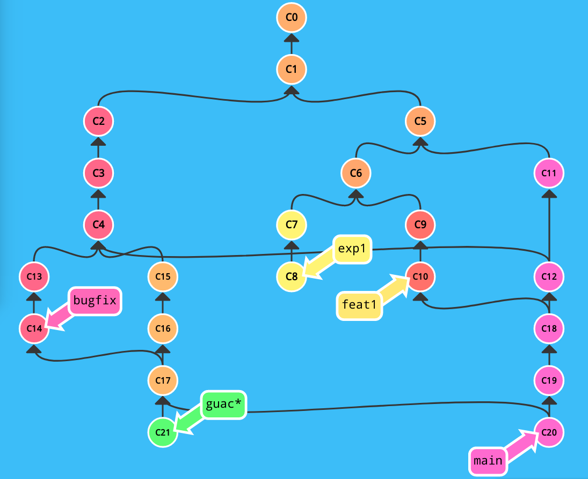

# Version Control

## Intro to git

Good practice in programming project management requires a version control system. 

Old school techniques are usually bad.

- Version filenames is a disaster. 
    - mythesis_v1.tex, mythesis_v2.tex, mythesis_last_v3.tex
    - create clutter
    - Filenames rarely contain information other than chronology
    - Parallel independent changes super hard to keep track of
    - Did you finally notice a problem in v119 that has been around for a while, but you have no idea where the error was introduced?

- Sharing files with others is a disaster. 
    - Emailing files sucks --- only magnifies the problems above
    - Track changes feature Google Docs or Word --- not so useful for anything complex

- Disaster recover is a disaster. 
    - Oh F#@K! Did I just overwrite all my work from last night??!!!?


Modern version control techniques are usually great.

Modern tools to promote collective intelligence.

- Automated history of everything 
    - not just files, but whole projects with folders and subfolders 
    - who, what, when, and (most important) why

- Automated sharing of everyone's latest edits
    - no more emailing files around

- Easier disaster recovery with distributed VCSes like Git or Mercurial (see later)

- Support for automated testing (we'll cover this in future lectures)

- Infinite sandboxes for clutter-free, fear-free experimentation
    - this is where Git especially shines -- main topic today

- CAVEAT 1: All of this works best with plain text files

- CAVEAT 2: All of this works best with a highly modular file structure

- The git feedback effect: 
    - Using git encourages positive changes to your workflow. 
    - And making your workflow more git-friendly will make your work better overall.


## Brief history of version control.


- Local Version Control
    - Mainly just reduced clutter and automated tracking of chronology...

- Centralized Version Control
    - Allows group work on the same files...
    - Single point of failure --- there is only a single "real" repository
    - Backing up is a separate process
    - File locks --- create "race conditions" for commiting changes to that "real" repository
    - What if you lose internet?
    - Branching is cumbersome, so people don't do it (and have trouble reconciling disparate histories when they do)

- Distributed Version Control
    - Resolve most of the above issues...
    - Many separate and independent repos; all are "first-class" citizens
    - Can make commits locally even without internet...
    - ...but can transfer history and information between repositories
    - Branching is lightweight and easy (mainly in Git)

## Core concepts in git

Branches and DAGs

A DAG is a directed acyclic graph linking together a sequence of tasks.

Let's calibrate people's intuitions about git terminology: how many branches are in this DAG?



Best way to get comfortable conceptually with git branching is to see it in action. 

So let's do an exercise...

Things to keep in mind during our exercise

- Just a quick tour

- There is a 2-part PICSciE workshop on Git on Oct 05 and 07. Do it!

- Some git operations are of a "send it out" variety, while others are of a "bring it in" variety
    - important to keep straight which are of which flavor

- Some git operations are repo-wise, while others are branch-wise

Your git branching sandbox

Open a browser to this URL: https://learngitbranching.js.org/?NODEMO

Other resources for git:
- https://gitimmersion.com/
- http://think-like-a-git.net/
- http://ndpsoftware.com/git-cheatsheet.html
- https://ohshitgit.com/
- http://gitready.com/
- https://explainshell.com/

## Getting started with git

Setting up your git environment.
On your Terminal window, type the following commands.

```bash
> git config --global user.name 'Romain Teyssier'
> git config --global user.email 'teyssier@princeton.edu'
```
Create a new directory.

```bash
> mkdir mywork
> cd mywork
```
Create a new git project.
```bash
> git init
Initialized empty Git repository in /Users/rt3504/mywork/.git/
```
Now edit your first file.
```bash
> emacs -nw file1.txt
> cat file1.txt
This is my first file.
```
Add this file to the staging area and commit your first change.
```bash
> git add file1.txt
> git commit -m "First commit"
[master (root-commit) c073d19] First commit
 1 file changed, 1 insertion(+)
 create mode 100644 file1.txt
```
What is the staging area? This is where you put your modifications in the queue, one after the otherm, using the ```git add``` command.
git tracks only differences between successive versions. You can then commit these changes to the repository with the ```git commit``` command.

## Checking the status of your repository

We can now check the status of our repository using the command
```bash
> git status
On branch master
nothing to commit, working tree clean
```
Let's now make our first change.
```bash
> emacs -nw file1.txt
> cat file1.txt
This is my first file but I modifed it.
```
Let see now the status of our repository.
```bash
> git status
On branch master
Changes not staged for commit:
  (use "git add <file>..." to update what will be committed)
  (use "git restore <file>..." to discard changes in working directory)
	modified:   file1.txt

no changes added to commit (use "git add" and/or "git commit -a")
```
Let's add these changes to the staging area.
```bash
> git add file1.txt
> git status
On branch master
Changes to be committed:
  (use "git restore --staged <file>..." to unstage)
	modified:   file1.txt
```
Let's commit those changes.
```bash
> git commit -m "Commit changes"
[master 476b980] Commit changes
 1 file changed, 1 insertion(+), 1 deletion(-)
> git status
On branch master
nothing to commit, working tree clean
```
When you commit changes, using ```git commit -m``` allows you to give a commit message on the command line.
Without the ```-m``` options, git will launch an editor (default is usually ```vim```). To set your own editor, use:
```bash
> export GIT_EDITOR='emacs -nw'
```
Try and see what happens if you commit another change without the ```-m``` option.
Just follow the instruction, add your message in your favorite text editor and save the file.

## View the history of your project

To see the past history of your project, type:
```bash
> git log
commit 476b9801a6fb1efefdcd6c4d1bc82bff43686f9e (HEAD -> master)
Author: Romain Teyssier <romain.teyssier@gmail.com>
Date:   Thu Oct 6 09:48:30 2022 -0400

    Commit changes

commit c073d19d60ca399ab70e9a9b720cefeaa36c84a6
Author: Romain Teyssier <romain.teyssier@gmail.com>
Date:   Thu Oct 6 09:37:43 2022 -0400

    First commit
```

A nicer way of looking at the history of your repository:
```bash
> git log --pretty=format:'%h %ad | %s%d [%an]' --graph --date=short
* 476b980 2022-10-06 | Commit changes (HEAD -> master) [Romain Teyssier]
* c073d19 2022-10-06 | First commit [Romain Teyssier]
```

Another more complex example with the RAMSES code
```bash
> git log --pretty=format:'%h %ad | %s%d [%an]' --graph --date=short
* c6935e35 2022-10-06 | Remove link to obsolete web site. (HEAD -> master, origin/master, origin/HEAD) [Romain Teyssier]
* 7ff87436 2022-10-05 | Fix an issue with geticmask [Romain Teyssier]
* 25683b3e 2022-10-05 | Fix some remaining issues with get_music_refmask.f90 [Romain Teyssier]
*   f18b114f 2022-10-05 | Merge branch 'master' of https://bitbucket.org/rteyssie/ramses [Romain Teyssier]
|\
| * e1a84c3d 2022-10-05 | Fix reading in get_music_refmask for zoom IC generation [Romain Teyssier]
| * 693af13e 2022-10-05 | Fix reading in get_music_refmask for zoom IC generation [Romain Teyssier]
| *   050cb1f0 2022-06-28 | Merged in master (pull request #498) [Benoit Commercon]
| |\
| | * 01939fbc 2022-06-28 | Update patch/mhd/coeur to work with the latest version [Benoit Commercon]
| |/
| *   168872a9 2022-06-21 | Merge branch 'master' of bitbucket.org:rteyssie/ramses [rteyssier]
| |\
| | *   dc87ff86 2022-06-17 | Merge branch 'master' of bitbucket.org:rteyssie/ramses [Romain Teyssier]
| | |\
| | * \   1fb6d9aa 2022-06-09 | Merge branch 'master' of bitbucket.org:rteyssie/ramses [Romain Teyssier]
| | |\ \
| | * \ \   ecfbf508 2022-06-09 | Merge branch 'master' of bitbucket.org:rteyssie/ramses [Romain Teyssier]
| | |\ \ \
| | * \ \ \   52f82b4c 2022-05-13 | Merge branch 'master' of bitbucket.org:rteyssie/ramses [Romain Teyssier]
| | |\ \ \ \
| | * \ \ \ \   79c3a2ff 2022-05-12 | Merge branch 'master' of bitbucket.org:rteyssie/ramses [Romain Teyssier]
| | |\ \ \ \ \
| | * \ \ \ \ \   9cb29fad 2022-05-10 | Merge branch 'master' of bitbucket.org:rteyssie/ramses [Romain Teyssier]
| | |\ \ \ \ \ \
| | * \ \ \ \ \ \   0afc647d 2022-03-12 | Merge branch 'master' of bitbucket.org:rteyssie/ramses [Romain Teyssier]
| | |\ \ \ \ \ \ \
| | * \ \ \ \ \ \ \   0c064bc7 2022-03-11 | Merge branch 'master' of bitbucket.org:rteyssie/ramses [Romain Teyssier]
| | |\ \ \ \ \ \ \ \
| | * \ \ \ \ \ \ \ \   28a59d77 2022-01-24 | Merge branch 'master' of bitbucket.org:rteyssie/ramses [Romain Teyssier]
| | |\ \ \ \ \ \ \ \ \
| | * \ \ \ \ \ \ \ \ \   378c2575 2022-01-07 | Merge branch 'master' of bitbucket.org:rteyssie/ramses [Romain Teyssier]
| | |\ \ \ \ \ \ \ \ \ \
| | * | | | | | | | | | | c305dc3e 2022-01-07 | add single test execution script [Romain Teyssier]
| * | | | | | | | | | | | 40da76fa 2022-06-21 | Fix a big in map2img.py [rteyssier]
| | |_|_|_|_|_|_|_|_|_|/
| |/| | | | | | | | | |
| * | | | | | | | | | | 454bc45b 2022-06-17 | Add OUTPUT_PARTICLE_DENSITY pre-compiler directive for output_poisson in grav files [rteyssier]
* | | | | | | | | | | | aa383b47 2022-06-17 | Merge branch 'master' of https://bitbucket.org/rteyssie/ramses [Romain Teyssier]
|\| | | | | | | | | | |
| * | | | | | | | | | | ef88770b 2022-06-17 | Modify amr2map to read grav file instead of hydro file [rteyssier]
| | |_|_|_|_|_|_|_|_|/
| |/| | | | | | | | |
* / | | | | | | | | | 54052ade 2022-06-17 | Modify amr2map to read grav file instead of hydro file [Romain Teyssier]
|/ / / / / / / / / /
* | | | | | | | | / 9c3316ae 2022-06-09 | Correct a nasty bug in case of MC tracers. part2map.f90 edited online with Bitbucket [Romain Teyssier]
| |_|_|_|_|_|_|_|/
|/| | | | | | | |
```

## Manipulating history

## Collaborative development

## Hooks and configuration
